# Technical Architecture: OpenClaw Config Generator Web App

> Research document for the automated setup wizard (Tier 1 product)

---

## 1. Config Generation

### How openclaw.json Works

From our existing templates, the config has a consistent structure:

```jsonc
{
  "logging": { "level": "info" },
  "agent": { "model": "...", "workspace": "...", "thinkingDefault": "...", ... },
  "channels": { /* channel-specific blocks */ },
  "session": { /* reset rules, scope */ },
  "tools": { /* exec security, web search keys */ },
  "routing": { /* optional: mention patterns for groups */ }
}
```

### Approach: Hybrid Template + Dynamic

**Pure template** (find-and-replace placeholders) is too rigid — different channel combos produce different config shapes. **Pure dynamic** (build JSON from scratch) is fragile and hard to validate.

**Recommended: Template fragments composed dynamically.**

```
base_config (always present)
  + agent_block (model choice, thinking level)
  + channel_block[] (one per selected channel, each a template)
  + session_block (based on user type)
  + tools_block (based on technical level)
  + routing_block (only if group channels selected)
```

Each fragment is a validated JSON partial. The generator deep-merges them.

### Channel-Specific Config Fields

| Channel   | Required Fields | User Must Provide |
|-----------|----------------|-------------------|
| WhatsApp  | `allowFrom` (phone numbers) | Their phone number (international format) |
| Telegram  | `botToken` in env, allowlist config | Bot token from @BotFather |
| Discord   | `botToken`, `guilds`, `channels` | Bot token, guild ID, channel ID |
| Webchat   | (none — built in) | Nothing |

**Key insight:** We NEVER handle tokens/keys in our app. The config generator outputs placeholders like `"PASTE_YOUR_TELEGRAM_TOKEN_HERE"` with clear instructions. Or better: the generated install script prompts for these values at install time, injecting them locally.

### Validation

Client-side validation before download:
1. **Schema validation** — JSON Schema for openclaw.json (we write one)
2. **Required field check** — phone numbers match E.164 format, channels have required sub-fields
3. **Logical validation** — can't have `exec.security: "full"` with `thinkingDefault: "off"` (smells like a mistake)
4. **Preview** — show the generated config with syntax highlighting before download

Library: [Ajv](https://ajv.js.org/) for JSON Schema validation (8KB gzipped, runs client-side).

---

## 2. Install Script Generation

### How Homebrew Does It

Homebrew's install (`/bin/bash -c "$(curl -fsSL https://raw.githubusercontent.com/.../install.sh)"`) follows this pattern:

1. **Single static script** hosted on GitHub (not generated per-user)
2. Script detects OS via `uname -s` and `uname -m`
3. Downloads the right binary for the platform
4. Checks for prerequisites (Xcode CLT on Mac, etc.)
5. Sets up paths and permissions
6. Uses `set -e` for fail-fast, never runs `rm -rf`

### How nvm Does It

nvm's install script (`curl -o- https://raw.githubusercontent.com/nvm-sh/nvm/v0.39.7/install.sh | bash`):

1. Detects shell (bash/zsh/fish) via `$SHELL` and profile files
2. Detects OS for correct binary downloads
3. Clones the nvm repo or downloads archive
4. Adds sourcing line to `.bashrc`/`.zshrc`/`.profile`
5. Verifies installation by trying `nvm --version`

### Our Approach: Per-User Generated Script

We CAN generate a custom script per user because our config varies per user. Two scripts:

#### Unix Script (macOS/Linux/WSL2) — `setup.sh`

```bash
#!/usr/bin/env bash
set -euo pipefail

# ── Generated by CrustaceanOps Setup Wizard ──
# Config ID: abc123 (for support reference)
# Generated: 2025-02-02T15:30:00Z

echo "🦀 CrustaceanOps — OpenClaw Setup"
echo "=================================="

# Step 1: Check prerequisites
check_node() {
  if ! command -v node &>/dev/null; then
    echo "❌ Node.js not found. Install it first:"
    echo "   curl -o- https://raw.githubusercontent.com/nvm-sh/nvm/v0.40.1/install.sh | bash"
    echo "   nvm install 22"
    exit 1
  fi
  NODE_VER=$(node -v | cut -d'v' -f2 | cut -d'.' -f1)
  if [ "$NODE_VER" -lt 22 ]; then
    echo "❌ Node.js $NODE_VER found, but 22+ required"
    echo "   nvm install 22 && nvm use 22"
    exit 1
  fi
  echo "✅ Node.js $(node -v)"
}

# Step 2: Install OpenClaw
install_openclaw() {
  echo "📦 Installing OpenClaw..."
  npm install -g openclaw@latest
  echo "✅ OpenClaw $(openclaw --version)"
}

# Step 3: Write config (EMBEDDED — no server calls)
write_config() {
  mkdir -p ~/.openclaw/workspace
  cat > ~/.openclaw/openclaw.json << 'CONFIGEOF'
__GENERATED_CONFIG_HERE__
CONFIGEOF
  echo "✅ Config written to ~/.openclaw/openclaw.json"
}

# Step 4: Write workspace files
write_workspace() {
  cat > ~/.openclaw/workspace/SOUL.md << 'SOULEOF'
__GENERATED_SOUL_HERE__
SOULEOF
  cat > ~/.openclaw/workspace/USER.md << 'USEREOF'
__GENERATED_USER_HERE__
USEREOF
  echo "✅ Workspace files written"
}

# Step 5: Interactive prompts for secrets (NEVER embedded in script)
collect_secrets() {
  echo ""
  echo "🔐 Now let's add your API keys (these stay on YOUR machine only)"
  read -rp "Anthropic API key: " ANTHROPIC_KEY
  # Write to .env or openclaw's secret store
  openclaw config set auth.apiKey "$ANTHROPIC_KEY"
  
  # Channel-specific secrets (conditional based on generated config)
  __CHANNEL_SECRET_PROMPTS__
  
  echo "✅ Secrets stored locally"
}

# Step 6: Verify
verify() {
  echo ""
  echo "🔍 Running health check..."
  openclaw health
  openclaw security audit --deep
  echo ""
  echo "🎉 Setup complete! Send a message to your assistant to test."
}

# Run
check_node
install_openclaw
write_config
write_workspace
collect_secrets
verify
```

#### PowerShell Script (Windows without WSL) — `setup.ps1`

Same flow but in PowerShell. However, we should **strongly recommend WSL2** and detect/guide them toward it.

### Safety Measures

1. **No `rm -rf` ever** — only `mkdir -p` and file writes
2. **`set -euo pipefail`** — stop on any error
3. **Dry-run mode** — `./setup.sh --dry-run` shows what it WOULD do
4. **Checksums** — script includes a SHA256 of the embedded config so user can verify
5. **No sudo** — everything runs in user space
6. **Secrets prompted interactively** — never embedded in the script
7. **Idempotent** — safe to run twice (checks before installing)

---

## 3. OS Detection from Browser

### navigator.userAgent / navigator.platform (Modern)

`navigator.userAgent` is being deprecated. Use **`navigator.userAgentData`** (User-Agent Client Hints) where available, with `userAgent` as fallback.

```javascript
function detectOS() {
  // Modern approach (Chromium browsers)
  if (navigator.userAgentData?.platform) {
    const p = navigator.userAgentData.platform.toLowerCase();
    if (p.includes('mac')) return 'macos';
    if (p.includes('windows')) return 'windows';
    if (p.includes('linux')) return 'linux';
  }
  
  // Fallback (Firefox, Safari, older browsers)
  const ua = navigator.userAgent.toLowerCase();
  if (ua.includes('mac os x') || ua.includes('macintosh')) return 'macos';
  if (ua.includes('windows')) return 'windows';
  if (ua.includes('linux')) return 'linux';
  if (ua.includes('android')) return 'android'; // mobile — show "use a computer" message
  if (ua.includes('iphone') || ua.includes('ipad')) return 'ios'; // same
  
  return 'unknown';
}
```

### WSL2 Detection

**Cannot detect WSL2 from browser.** The browser runs on Windows, not inside WSL. Instead:

1. **Ask the user:** "Do you have WSL2 installed?" with a one-click test:
   - "Open PowerShell and run: `wsl --list --verbose`"
   - "Paste the output here" → we parse it to confirm WSL2 + a distro
2. **Or:** Provide a tiny test script they run: `wsl echo "WSL_OK"` — if it returns "WSL_OK", they have it.

### Adaptive Instructions

Based on OS detection, the wizard adapts:

| OS | Install Method | Shell | Notes |
|----|---------------|-------|-------|
| macOS | Homebrew + nvm | bash/zsh | Most straightforward |
| Linux | nvm directly | bash | Varies by distro, but Node install is universal |
| Windows + WSL2 | nvm inside WSL | bash (inside WSL) | Must emphasize: "run everything inside WSL terminal" |
| Windows (no WSL) | Direct Node installer + npm | PowerShell | Discourage this path; guide toward WSL2 first |

---

## 4. Workspace File Generation

### Templates with Variable Substitution

Simple approach using tagged template literals:

```javascript
const soulTemplate = (vars) => `# SOUL.md — Who You Are

You are **${vars.assistantName}**, ${vars.personalityDescription}.

## Core Identity
- **Name:** ${vars.assistantName}
- **Emoji:** ${vars.emoji}
- **Tone:** ${vars.tone}
- **Style:** ${vars.communicationStyle}

## Primary Purpose
${vars.mainPurpose}

## Rules
${vars.rules.map(r => `- ${r}`).join('\n')}
`;
```

Quiz answers map to template variables:

| Quiz Question | Maps To |
|--------------|---------|
| "What's your assistant's name?" | `assistantName` |
| "Pick a personality" (dropdown) | `personalityDescription`, `tone`, `communicationStyle` |
| "What should it help with?" (multi-select) | `mainPurpose`, `rules` |
| "Your name?" | `USER.md → userName` |
| "Your timezone?" | `USER.md → timezone` (auto-detect from `Intl.DateTimeFormat().resolvedOptions().timeZone`) |

### Downloadable ZIP

Use **JSZip** (90KB, client-side, well-maintained):

```javascript
import JSZip from 'jszip';
import { saveAs } from 'file-saver';

async function generateWorkspaceZip(config, soul, user, identity) {
  const zip = new JSZip();
  
  // Config
  zip.file('openclaw.json', JSON.stringify(config, null, 2));
  
  // Workspace files
  const workspace = zip.folder('workspace');
  workspace.file('SOUL.md', soul);
  workspace.file('USER.md', user);
  workspace.file('IDENTITY.md', identity);
  workspace.file('AGENTS.md', AGENTS_TEMPLATE); // standard, not customised
  workspace.file('TOOLS.md', TOOLS_TEMPLATE);
  
  // Install script
  zip.file('setup.sh', generateInstallScript(config));
  
  const blob = await zip.generateAsync({ type: 'blob' });
  saveAs(blob, 'openclaw-setup.zip');
}
```

**Alternative to ZIP:** A single `setup.sh` that contains everything (config + workspace files as heredocs). Simpler for the user — one command does it all.

---

## 5. Progress Tracking

### Step Verification

| Step | How to Verify |
|------|--------------|
| Node installed | "Run `node -v` and paste output" → regex match `v2[2-9]` |
| OpenClaw installed | "Run `openclaw --version` and paste" → regex match version string |
| Config written | "Run `openclaw health` and paste" → check for "config: ok" |
| Channel connected | "Send a test message and screenshot it" → manual confirm button |
| Security audit | "Run `openclaw security audit --deep` and paste" → parse for "PASS" |

### Terminal Output Validation

```javascript
function validateStep(stepId, pastedOutput) {
  const validators = {
    'node-version': {
      regex: /v(\d+)\.\d+\.\d+/,
      validate: (match) => parseInt(match[1]) >= 22,
      errorMsg: 'Node.js 22+ required. You have v{version}.',
      successMsg: 'Node.js {version} ✅'
    },
    'openclaw-version': {
      regex: /openclaw\/(\d+\.\d+\.\d+)/i,
      validate: () => true, // any version is fine
      successMsg: 'OpenClaw {version} ✅'
    },
    'health-check': {
      regex: /status:\s*(ok|healthy)/i,
      validate: () => true,
      successMsg: 'Health check passed ✅'
    }
  };
  // ...
}
```

### Progress State

**localStorage** for anonymous users:

```javascript
const PROGRESS_KEY = 'crustacean_setup_progress';

// Shape:
{
  startedAt: '2025-02-02T15:00:00Z',
  os: 'macos',
  currentStep: 3,
  steps: {
    1: { completed: true, completedAt: '...', data: { nodeVersion: '22.1.0' } },
    2: { completed: true, completedAt: '...' },
    3: { completed: false }
  },
  config: { /* generated config so far */ },
  quizAnswers: { /* personality quiz answers */ }
}
```

**Account-based tracking (v2):** Not for MVP. localStorage is sufficient. If they clear their browser, they can re-run the wizard in 5 minutes — not a big deal.

---

## 6. Tech Stack Decision

### Framework: **Next.js** (App Router)

| | React + Vite | Next.js |
|---|---|---|
| SSR / SEO | ❌ Need separate solution | ✅ Built in — critical for landing page |
| API routes | ❌ Need separate backend | ✅ Built in — useful for Stripe webhooks, analytics |
| Hosting | Vercel/Cloudflare/anywhere | Vercel (optimised) |
| Complexity | Simpler | Slightly more |
| Config wizard (SPA) | ✅ Great | ✅ Great (use `"use client"`) |

**Verdict: Next.js.** The landing page NEEDS SEO. Stripe webhooks need a server endpoint. The wizard itself is client-side (`"use client"` components), so we get the best of both. We know React; Next.js is just React with extras.

### Hosting: **Vercel** (free tier)

- Free tier: 100GB bandwidth, serverless functions, edge network
- Native Next.js support (they made it)
- Automatic preview deployments from Git
- Custom domain support
- Cloudflare Pages is great but Next.js support is less mature

### Payments: **Lemon Squeezy**

| | Stripe Checkout | Lemon Squeezy |
|---|---|---|
| Ease of setup | Moderate (tax handling is manual) | ✅ Dead simple (merchant of record) |
| Tax handling | ❌ You handle VAT/sales tax | ✅ They handle everything globally |
| Fees | 2.9% + 30¢ | 5% + 50¢ |
| One-time payments | ✅ | ✅ |
| Checkout UI | ✅ Polished | ✅ Polished |
| Webhook to Next.js | ✅ | ✅ |

**Verdict: Lemon Squeezy for MVP.** Higher fees but zero tax headache. At our volume ($79-199 per sale), the fee difference is ~$2-4 per sale. Not worth the complexity of handling international tax ourselves. Switch to Stripe later at scale.

### Analytics: **Plausible**

- Privacy-friendly (no cookie banner needed!)
- €9/mo or self-host free
- Simple, shows what matters
- PostHog is more powerful but overkill for MVP

**Or: Vercel Analytics** (built in, free tier, zero setup). Start here, add Plausible later.

### Support: **Crisp** (free tier)

- Free for 2 operators
- Chat widget + shared inbox
- Mobile app for responding on the go
- Can integrate with email
- Tawk.to is also free but Crisp's UX is cleaner

---

## 7. Security Considerations

### Iron Rules

1. **ALL config generation happens client-side (in the browser)**
   - No API keys, tokens, or secrets ever touch our server
   - The wizard is essentially a fancy form → JSON generator
   - Install script prompts for secrets interactively on the user's machine

2. **No sensitive data stored**
   - Quiz answers (name, timezone, personality prefs) are benign
   - Config templates contain no secrets (placeholders only)
   - localStorage on their machine — their responsibility

3. **Payment data handled by Lemon Squeezy**
   - We never see credit card numbers
   - Webhook only confirms "payment succeeded" with an order ID

4. **HTTPS everywhere**
   - Vercel provides this automatically
   - All external links use HTTPS

5. **Install script security**
   - Scripts are generated client-side and downloaded
   - No `curl | bash` from our server (the script IS the download)
   - Scripts are readable — user can inspect before running
   - No elevated permissions required

6. **No user accounts for MVP**
   - No passwords to leak
   - No database to breach
   - Progress is localStorage only

### What Could Go Wrong (Threat Model)

| Threat | Mitigation |
|--------|-----------|
| XSS in wizard | React's default escaping + CSP headers |
| Malicious config injection | JSON.stringify escapes everything; Ajv validates schema |
| Someone modifies the script after download | SHA256 checksum displayed in wizard |
| Our domain compromised | Script is self-contained; no phone-home |
| Man-in-the-middle | HTTPS (Vercel automatic) |

---

## 8. MVP Scope

### What MUST Be in v1

1. **Landing page** with clear value prop + pricing (Tier 1/2/3)
2. **OS detection** with adaptive instructions
3. **Config wizard** (5-7 steps):
   - Choose your persona (solo founder / developer / business user)
   - Pick channels (WhatsApp / Telegram / Discord / webchat)
   - Name your assistant + pick personality
   - Answer 3-5 preference questions
   - Review generated config
   - Download setup bundle (ZIP or single script)
4. **Payment integration** for Tier 2/3 (Lemon Squeezy checkout)
5. **Tier 2 intake form** (post-payment → we get notified to do async setup)
6. **Basic progress tracker** (localStorage, step-by-step checkboxes)
7. **Troubleshooting FAQ** page (from our existing docs)

### Nice-to-Have (v1.1)

- Video walkthroughs per step
- Terminal output paste-and-validate
- Crisp chat widget
- Email capture for free tier users
- Plausible analytics

### Cut from v1 (v2+)

- User accounts / login
- Team/multi-user setup (Tier 4)
- Skill marketplace integration
- Remote SSH setup automation
- Dashboard for tracking client setups
- Mobile-responsive wizard (desktop-first is fine — you need a computer to install)

---

## Recommended Tech Stack

| Layer | Choice | Why |
|-------|--------|-----|
| **Framework** | Next.js 14 (App Router) | SSR for landing page, client components for wizard, API routes for webhooks |
| **Styling** | Tailwind CSS + shadcn/ui | Fast to build, consistent design, accessible components |
| **Hosting** | Vercel (free tier) | Zero-config Next.js hosting, automatic HTTPS, preview deploys |
| **Payments** | Lemon Squeezy | Merchant of record, handles tax globally, simple integration |
| **Analytics** | Vercel Analytics (built-in) | Free, zero setup, upgrade to Plausible later |
| **Support** | Crisp (free tier) | Live chat widget, 2 operators free |
| **Config validation** | Ajv (client-side) | JSON Schema validation, lightweight |
| **ZIP generation** | JSZip + FileSaver.js | Client-side ZIP creation, well-maintained |
| **Forms** | React Hook Form + Zod | Type-safe validation, great DX |
| **State** | Zustand or React Context | Wizard state management (lightweight) |
| **Icons** | Lucide React | Clean, consistent, tree-shakeable |

---

## User Flow Diagram

```mermaid
graph TD
    A[🌐 Landing Page] --> B{Choose Path}
    B -->|Free / $29| C[Start Wizard]
    B -->|$79 Concierge| D[Lemon Squeezy Checkout]
    B -->|$199 White Glove| D
    
    D --> E[Payment Confirmed]
    E --> F[Intake Form]
    F --> G[We Set Up Async]
    G --> H[Delivery + Verify]
    
    C --> C1[Step 1: Detect OS]
    C1 --> C2[Step 2: Choose Persona]
    C2 --> C3[Step 3: Pick Channels]
    C3 --> C4[Step 4: Name + Personality]
    C4 --> C5[Step 5: Preferences Quiz]
    C5 --> C6[Step 6: Review Config]
    C6 --> C7[Step 7: Download Bundle]
    
    C7 --> D1[Run Setup Script]
    D1 --> D2[Enter API Keys Locally]
    D2 --> D3[Health Check]
    D3 --> D4[🎉 Send First Message]
    
    C6 -->|Want help?| D
    
    style A fill:#1e40af,color:#fff
    style C fill:#059669,color:#fff
    style D fill:#7c3aed,color:#fff
    style D4 fill:#059669,color:#fff
```



---

## MVP Feature List

### Must-Have ✅
- [ ] Landing page with pricing tiers
- [ ] OS detection (Mac/Windows/Linux)
- [ ] Config wizard (5-7 step flow)
- [ ] Three persona templates (solo-founder, developer, business-user)
- [ ] Channel selection with conditional fields
- [ ] Client-side config generation (JSON)
- [ ] Install script generation (bash)
- [ ] Downloadable ZIP bundle (config + workspace + script)
- [ ] Lemon Squeezy payment integration (Tier 2/3)
- [ ] Post-payment intake form
- [ ] Troubleshooting FAQ page
- [ ] Mobile "use a computer" notice

### Nice-to-Have 🔜
- [ ] Terminal output paste-and-validate
- [ ] Progress tracker with localStorage
- [ ] Video walkthroughs (embedded)
- [ ] Crisp live chat widget
- [ ] Email capture / newsletter signup
- [ ] PowerShell script for Windows (no WSL)
- [ ] Dark mode
- [ ] Plausible analytics

### Future (v2+) 🔮
- [ ] User accounts + saved configs
- [ ] Team setup wizard (Tier 4)
- [ ] Remote SSH automation
- [ ] Skill marketplace integration
- [ ] Client management dashboard
- [ ] Affiliate/referral system
- [ ] API for programmatic config generation

---

## Estimated Build Time (MVP)

| Task | Time | Notes |
|------|------|-------|
| Next.js project setup + Tailwind + shadcn | 2h | Boilerplate |
| Landing page (hero, pricing, features) | 4h | Copy + design |
| Config wizard UI (7 steps) | 8h | Forms, validation, state management |
| Config generation engine | 4h | Template fragments, deep merge, Ajv validation |
| Install script generator | 3h | Bash template with heredocs |
| ZIP bundle generation | 2h | JSZip integration |
| Workspace file templates (SOUL/USER/IDENTITY) | 2h | Template strings from quiz answers |
| OS detection + adaptive UI | 1h | Small utility |
| Lemon Squeezy integration | 3h | Checkout link + webhook handler |
| Intake form (post-payment) | 2h | Simple form → email notification |
| FAQ / troubleshooting page | 2h | From existing docs |
| Testing + polish | 4h | Cross-browser, edge cases |
| Deploy to Vercel | 1h | Domain, env vars, DNS |
| **Total** | **~38h** | **~5 working days** |

With focused effort: **1 week to MVP**. With real-life interruptions: **2 weeks**.

---

## Key Architectural Decisions Summary

1. **Client-side only config generation** — security by design, no backend needed for core feature
2. **Next.js over Vite** — landing page SEO is non-negotiable for organic traffic
3. **Lemon Squeezy over Stripe** — tax compliance without the headache
4. **Single setup script over ZIP** — simpler UX (one command), though offer ZIP as alternative
5. **No user accounts in MVP** — localStorage is sufficient, reduces attack surface to zero
6. **Template fragments over monolithic templates** — composable, easier to maintain as OpenClaw evolves
7. **Interactive secret prompts in script** — secrets never leave the user's machine
