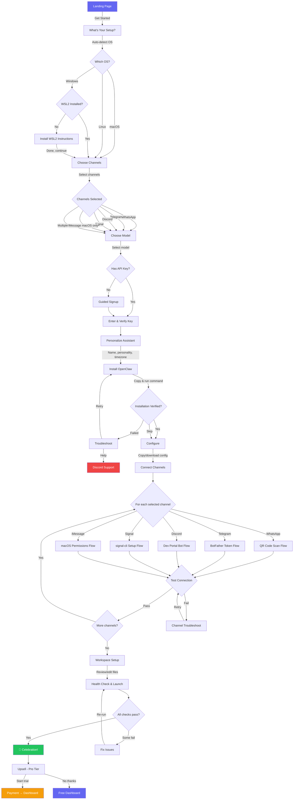

# OpenClaw Setup Wizard — Complete UX Flow

> **Design Philosophy:** Vercel's deploy flow meets TurboTax's guided experience.  
> **Target:** Under 10 minutes from landing to "Your assistant is ready!"  
> **Audience:** Technical-adjacent users (comfortable with a terminal, but not DevOps pros)

---

## Global Components

### Progress Stepper
- Horizontal pill-shaped stepper at top, fixed position
- Steps: **Setup → Channels → Model → Personalize → Install → Configure → Connect → Launch**
- Current step = filled accent color, completed = checkmark + green, future = gray outline
- Clicking completed steps navigates back (preserves state)
- On mobile: collapses to "Step 3 of 8" with a mini progress bar
- Subtle bounce animation when advancing to next step

### "I'm Stuck" Escape Hatch
- Floating bottom-right pill button on every screen: `💬 Need help?`
- Opens slide-up drawer with:
  - Link to Discord support channel
  - Link to FAQ/troubleshooting docs
  - "Email us" fallback
  - Context-aware: pre-fills which step they're on
- Never blocks primary content

### Error Message Pattern
- Inline errors: red border on input + message below in `text-red-500`, shake animation
- Toast errors: top-center, auto-dismiss 5s, with "Details" expand
- Blocking errors: inline card with red-left-border, icon, message, and suggested fix
- All errors are actionable: never just "Something went wrong" — always "X failed because Y. Try Z."

### Loading States
- Skeleton shimmer for content areas
- Spinner + verb for actions ("Verifying...", "Generating config...", "Testing connection...")
- Never block the whole screen — load sections independently

### Tooltip/Help Pattern
- `ⓘ` icon next to any jargon or non-obvious field
- Hover (desktop) / tap (mobile) shows popover with 1-2 sentence explanation
- Some include a "Learn more →" link to docs

### Transitions
- All screen transitions: 300ms fade + 20px slide-up (Framer Motion)
- Success moments: confetti burst (lottie, 1.5s) on step completion
- Micro-interactions: buttons scale 0.97 on press, inputs glow on focus

---

## Screen 1: Landing / Welcome

**URL:** `/`  
**Time:** ~30 seconds

### Layout
```
┌─────────────────────────────────────────────┐
│  [Logo]                    [Docs] [GitHub ★] │
├─────────────────────────────────────────────┤
│                                              │
│   Your AI assistant,                         │
│   running on your machine.                   │
│                                              │
│   Private. Personal. Powerful.               │
│                                              │
│   [ Get Started — Free ]  (primary CTA)      │
│   "Takes under 10 minutes"                   │
│                                              │
├─────────────────────────────────────────────┤
│  ┌──────┐  ┌──────┐  ┌──────┐               │
│  │ Free │  │ Pro  │  │ Team │               │
│  │ $0   │  │ $29  │  │ $79  │               │
│  │ ...  │  │ ...  │  │ ...  │               │
│  └──────┘  └──────┘  └──────┘               │
├─────────────────────────────────────────────┤
│  "Trusted by 2,400+ users"                   │
│  ★★★★★ GitHub stars badge                    │
│  Testimonial cards (3, auto-rotate)          │
│  Channel logos: WhatsApp / Telegram / etc    │
└─────────────────────────────────────────────┘
```

### Required Inputs
- None

### Validation
- N/A

### Error States
- None possible

### Success State
- User clicks "Get Started" → advance

### Mobile Adaptation
- Stack pricing tiers vertically, collapsible accordion
- Testimonials become swipeable carousel
- CTA becomes sticky bottom bar

---

## Screen 2: What's Your Setup?

**URL:** `/setup/os`  
**Time:** ~20 seconds

### Layout
```
┌─────────────────────────────────────────────┐
│  [Stepper: Step 1 of 8 — Setup]             │
├─────────────────────────────────────────────┤
│                                              │
│   We detected you're on:                     │
│                                              │
│   ┌─────────┐  ┌─────────┐  ┌─────────┐    │
│   │  macOS  │  │  Linux  │  │ Windows │    │
│   │  (auto) │  │         │  │         │    │
│   └─────────┘  └─────────┘  └─────────┘    │
│                                              │
│   "Not right? Click to change."              │
│                                              │
│   [Continue →]                               │
└─────────────────────────────────────────────┘
```

**If Windows is selected:**
```
┌─────────────────────────────────────────────┐
│  ⚠️ Windows requires WSL2                    │
│                                              │
│  Checking... ✅ WSL2 detected!               │
│  — OR —                                      │
│  ❌ WSL2 not found.                          │
│                                              │
│  Run this in PowerShell (as Admin):          │
│  ┌──────────────────────────────────┐        │
│  │ wsl --install            [Copy] │        │
│  └──────────────────────────────────┘        │
│  Then restart your computer and come back.   │
│                                              │
│  [ I've installed WSL2, continue → ]         │
└─────────────────────────────────────────────┘
```

### Required Inputs
- OS selection (auto-detected, user confirms or overrides)

### Validation
- Must select one OS
- Windows: WSL2 check is advisory, not blocking (user self-reports)

### Error States
- WSL2 not detected → show install instructions (not a dead end)
- Unknown OS / auto-detect fails → default to showing all three, no pre-selection

### Success State
- OS selected → green checkmark on card, "Continue" enables
- Mini confetti on the selected card

### Mobile Adaptation
- Cards stack vertically
- Auto-detect via User-Agent still works
- WSL2 instructions note: "You'll need to do this on your desktop"

---

## Screen 3: Choose Your Channels

**URL:** `/setup/channels`  
**Time:** ~30 seconds

### Layout
```
┌─────────────────────────────────────────────┐
│  [Stepper: Step 2 of 8 — Channels]          │
├─────────────────────────────────────────────┤
│                                              │
│   Where should your assistant live?          │
│   Select one or more.                        │
│                                              │
│   ┌────────────┐  ┌────────────┐            │
│   │ 💬 WhatsApp│  │ ✈️ Telegram│            │
│   │ Most       │  │ Best for   │            │
│   │ popular    │  │ power users│            │
│   │ Needs phone│  │ Free, easy │            │
│   │ [SELECT]   │  │ [SELECT]   │            │
│   └────────────┘  └────────────┘            │
│                                              │
│   ┌────────────┐  ┌────────────┐            │
│   │ 🎮 Discord │  │ 📱 Signal  │            │
│   │ Great for  │  │ Privacy    │            │
│   │ communities│  │ focused    │            │
│   │ [SELECT]   │  │ [SELECT]   │            │
│   └────────────┘  └────────────┘            │
│                                              │
│   ┌────────────┐                             │
│   │ 🍎 iMessage│                             │
│   │ macOS only │                             │
│   │ [SELECT]   │                             │
│   └────────────┘                             │
│                                              │
│   ⓘ You can always add more later.           │
│                                              │
│   [Continue →]                               │
└─────────────────────────────────────────────┘
```

### Required Inputs
- At least one channel selected

### Validation
- ≥1 channel required. "Continue" disabled until selection made.
- iMessage grayed out if OS ≠ macOS (tooltip: "Requires macOS")
- Signal shows note: "Requires signal-cli setup"

### Error States
- No selection + click Continue → shake button, inline message "Pick at least one channel"

### Success State
- Selected cards get accent border + checkmark badge
- Count shown: "2 channels selected"

### Mobile Adaptation
- Single column card stack
- Cards are tap-to-toggle, no hover state needed

---

## Screen 4: Choose Your Model

**URL:** `/setup/model`  
**Time:** ~45 seconds

### Layout
```
┌─────────────────────────────────────────────┐
│  [Stepper: Step 3 of 8 — Model]             │
├─────────────────────────────────────────────┤
│                                              │
│   Which AI model powers your assistant?      │
│                                              │
│   ┌────────────────────────────────────┐     │
│   │ ⭐ Claude (Recommended)            │     │
│   │ Best overall • Great at reasoning  │     │
│   │ Sonnet for daily, Opus for complex │     │
│   │ ● Selected                         │     │
│   └────────────────────────────────────┘     │
│                                              │
│   ┌────────────────────────────────────┐     │
│   │ GPT-4o                             │     │
│   │ Fast • Good all-rounder            │     │
│   │ ○ Select                           │     │
│   └────────────────────────────────────┘     │
│                                              │
│   ┌────────────────────────────────────┐     │
│   │ Other (Ollama, Groq, etc.)         │     │
│   │ Advanced • Self-hosted options     │     │
│   │ ○ Select                           │     │
│   └────────────────────────────────────┘     │
│                                              │
│   ── API Key ──────────────────────────      │
│   │ sk-ant-...                    [👁] │     │
│   ──────────────────────────────────────     │
│   🔒 Stored locally, never sent to us.      │
│                                              │
│   Don't have one? [Get a Claude API key →]   │
│                                              │
│   [Continue →]                               │
└─────────────────────────────────────────────┘
```

### Required Inputs
- Model selection (radio)
- API key (text input, required)

### Validation
- API key format check:
  - Claude: starts with `sk-ant-` 
  - OpenAI: starts with `sk-`
  - Other: non-empty string
- Optional: test API call to validate key works (with loading spinner)

### Error States
- Invalid key format → "This doesn't look like a valid [provider] API key. It should start with `sk-ant-`"
- Key test fails → "We couldn't verify this key. Double-check it, or continue anyway."
- No key → "You'll need an API key to continue. [Get one →]"

### Success State
- Key validated → green checkmark next to input, "Key verified ✓"
- Model card gets accent highlight

### "Don't have one?" Flow
- Expand inline accordion:
  1. "Go to [console.anthropic.com](url)" (opens new tab)
  2. "Create an account or sign in"
  3. "Go to API Keys → Create Key"
  4. "Copy and paste it above"
- With annotated screenshots

### Mobile Adaptation
- Cards full-width stacked
- API key input gets larger touch target
- "Get a key" instructions work well on mobile (links open in browser)

---

## Screen 5: Personalize Your Assistant

**URL:** `/setup/personalize`  
**Time:** ~45 seconds

### Layout
```
┌─────────────────────────────────────────────┐
│  [Stepper: Step 4 of 8 — Personalize]       │
├─────────────────────────────────────────────┤
│                                              │
│   Make it yours.                             │
│                                              │
│   Your name                                  │
│   ┌──────────────────────────────┐           │
│   │ Richard                      │           │
│   └──────────────────────────────┘           │
│                                              │
│   Assistant name                             │
│   ┌──────────────────────────────┐           │
│   │ Clawd                        │  (default)│
│   └──────────────────────────────┘           │
│                                              │
│   Personality                                │
│   ┌──────┐ ┌────────┐ ┌─────────┐ ┌──────┐  │
│   │ 🏢  │ │ 😊    │ │ 🔧     │ │ ✏️  │  │
│   │ Pro  │ │Friendly│ │Technical│ │Custom│  │
│   └──────┘ └────────┘ └─────────┘ └──────┘  │
│                                              │
│   Timezone                                   │
│   ┌──────────────────────────────┐           │
│   │ Europe/London (detected)  ▼  │           │
│   └──────────────────────────────┘           │
│                                              │
│   Preview:                                   │
│   ┌──────────────────────────────────┐       │
│   │ 🤖 "Hey Richard! I'm Clawd,     │       │
│   │    your friendly AI assistant.   │       │
│   │    What can I help with?"        │       │
│   └──────────────────────────────────┘       │
│                                              │
│   [Continue →]                               │
└─────────────────────────────────────────────┘
```

### Required Inputs
- Your name (required)
- Assistant name (pre-filled "Clawd", editable)
- Personality (required, default "Friendly")
- Timezone (auto-detected, dropdown override)

### Validation
- Name: non-empty, max 50 chars
- Assistant name: non-empty, max 30 chars, alphanumeric + spaces
- Timezone: must be valid IANA timezone

### Error States
- Empty name → "We need your name so your assistant knows what to call you"

### Success State
- Live preview message updates as user types (debounced 300ms)
- Personality selection triggers preview message change with personality flavor

### Custom Personality
- If "Custom" selected → textarea expands: "Describe how your assistant should behave"
- Placeholder: "e.g., Speak like a pirate who's also a financial advisor"
- Max 500 chars

### Mobile Adaptation
- Personality pills wrap to 2x2 grid
- Preview card sticky at bottom of viewport while editing

---

## Screen 6: Install OpenClaw

**URL:** `/setup/install`  
**Time:** ~2 minutes

### Layout
```
┌─────────────────────────────────────────────┐
│  [Stepper: Step 5 of 8 — Install]           │
├─────────────────────────────────────────────┤
│                                              │
│   Let's install OpenClaw.                    │
│                                              │
│   1️⃣ Open your terminal                      │
│   ⓘ [How to open a terminal on macOS →]      │
│                                              │
│   2️⃣ Paste this command:                     │
│   ┌────────────────────────────────────┐     │
│   │ curl -fsSL https://openclaw.sh |   │     │
│   │ bash                        [📋]  │     │
│   └────────────────────────────────────┘     │
│   "📋 Copied!" (on click, 2s then revert)   │
│                                              │
│   3️⃣ Verify it worked                       │
│   Paste the last line of output here:        │
│   ┌────────────────────────────────────┐     │
│   │                                    │     │
│   └────────────────────────────────────┘     │
│   [Verify Installation]                      │
│                                              │
│   ── What to expect ──────────────────       │
│   ┌────────────────────────────────────┐     │
│   │ $ curl -fsSL ... | bash            │     │
│   │ Installing OpenClaw v2.1.0...      │     │
│   │ ✓ Dependencies checked             │     │
│   │ ✓ Binary installed                 │     │
│   │ ✓ PATH configured                  │     │
│   │ 🎉 OpenClaw installed!             │     │
│   │ Version: 2.1.0                     │     │
│   │ Run: openclaw --version            │ ←anim│
│   └────────────────────────────────────┘     │
│                                              │
│   [Skip verification, I'll do it later →]    │
└─────────────────────────────────────────────┘
```

### Platform-Specific Commands
- **macOS/Linux:** `curl -fsSL https://openclaw.sh | bash`
- **Windows (WSL):** Same command, but prefixed with note: "Run this inside WSL (Ubuntu terminal)"

### Required Inputs
- Verification text (optional — can skip)

### Validation
- Verification: check for `OpenClaw installed` or version string pattern
- Fuzzy match — accept partial pastes

### Error States
- Verification fails → "Hmm, that doesn't look right. Common issues:" + expandable troubleshooting:
  - "Permission denied" → `chmod +x` or `sudo`
  - "Command not found: curl" → install curl instructions
  - "Network error" → check connectivity
- Skip option always available

### Success State
- Verification passes → big green ✅, confetti burst
- "OpenClaw v2.1.0 installed successfully!"

### Animated Terminal
- CSS-animated typewriter effect showing expected output
- Lines appear one by one with realistic timing
- Green checkmarks animate in

### Mobile Adaptation
- Copy button extra prominent (users will switch to desktop)
- "Send these instructions to your email" option
- QR code linking to this page (for phone → desktop handoff)

---

## Screen 7: Configure

**URL:** `/setup/configure`  
**Time:** ~1 minute

### Layout
```
┌─────────────────────────────────────────────┐
│  [Stepper: Step 6 of 8 — Configure]         │
├─────────────────────────────────────────────┤
│                                              │
│   Here's your config. We built it from       │
│   your choices.                              │
│                                              │
│   ┌── openclaw.json ───────────────────┐     │
│   │ {                                  │     │
│   │   "model": {  ← Your AI model     │     │
│   │     "provider": "anthropic",       │     │
│   │     "model": "claude-sonnet-4-..."│     │
│   │     "apiKey": "sk-ant-***"         │     │
│   │   },                               │     │
│   │   "channels": { ← Your channels   │     │
│   │     "whatsapp": { "enabled": true }│     │
│   │     "telegram": { "enabled": true }│     │
│   │   },                               │     │
│   │   "assistant": { ← Personality     │     │
│   │     "name": "Clawd",               │     │
│   │   }                                │     │
│   │ }                                  │     │
│   └────────────────────────────────────┘     │
│                                              │
│   [📋 Copy Config]  [⬇ Download File]       │
│                                              │
│   Save it to:                                │
│   ┌────────────────────────────────────┐     │
│   │ mkdir -p ~/.openclaw && \          │     │
│   │ mv ~/Downloads/openclaw.json \     │     │
│   │ ~/.openclaw/               [📋]   │     │
│   └────────────────────────────────────┘     │
│                                              │
│   [Continue →]                               │
└─────────────────────────────────────────────┘
```

### Required Inputs
- None (config is pre-generated)

### Validation
- N/A at this step (validated later in health check)

### Error States
- None on this screen — it's informational

### Success State
- Copy/download action → toast "Config saved! Move it to ~/.openclaw/"

### Annotations
- Inline annotations on the JSON (colored highlights + tooltips)
- Each section has a `ⓘ` that explains what it controls
- Sensitive values (API key) are masked with "show" toggle

### Mobile Adaptation
- JSON view horizontally scrollable
- "Email config to myself" option
- Download button works on mobile (saves to Files)

---

## Screen 8: Connect Channels

**URL:** `/setup/connect`  
**Time:** ~3 minutes (varies by channel count)

### Layout — Tab-based, one tab per selected channel

```
┌─────────────────────────────────────────────┐
│  [Stepper: Step 7 of 8 — Connect]           │
├─────────────────────────────────────────────┤
│                                              │
│  [WhatsApp ✅] [Telegram ⏳] [Discord ○]     │
│                                              │
│  ═══ WhatsApp Setup ═══════════════════      │
│                                              │
│  Step 1: Start the WhatsApp bridge           │
│  ┌────────────────────────────────────┐      │
│  │ openclaw channel whatsapp    [📋] │      │
│  └────────────────────────────────────┘      │
│                                              │
│  Step 2: Scan the QR code                    │
│  ┌─────────────────────┐                     │
│  │                     │  1. Open WhatsApp   │
│  │    [QR placeholder] │  2. Settings →      │
│  │                     │     Linked Devices   │
│  │                     │  3. Scan this code   │
│  └─────────────────────┘                     │
│                                              │
│  📹 [Watch 30-second video guide]            │
│                                              │
│  Step 3: Test it                             │
│  [ Test Connection ]                         │
│                                              │
│  ✅ Connected! "Send yourself a message      │
│     to try it out."                          │
│                                              │
│  [Next Channel →]                            │
└─────────────────────────────────────────────┘
```

### Channel-Specific Sub-flows

**WhatsApp:**
1. Run bridge command → copy-paste
2. QR code scan (with video tutorial link)
3. Test connection button
- Error: "QR expired" → regenerate button
- Error: "Phone not connected" → troubleshooting tips

**Telegram:**
1. "Open @BotFather on Telegram" (deep link)
2. Send `/newbot`, follow prompts
3. Paste bot token here: `[input field]`
4. Run: `openclaw channel telegram --token <token>`
5. Test: send `/start` to your bot
- Error: "Invalid token" → format check + retry

**Discord:**
1. "Go to Discord Developer Portal" (link, opens new tab)
2. Create Application → Bot → Copy Token
3. Paste token: `[input field]`
4. Bot invite link auto-generated: "Add to your server" button
5. Test connection
- Error: "Missing permissions" → required permissions checklist

**Signal:**
1. Install signal-cli (platform-specific command)
2. Register/link to phone number
3. Configure OpenClaw
4. Test
- Note: "Signal setup is more involved — ~5 extra minutes"

**iMessage (macOS only):**
1. Grant permissions in System Preferences
2. Run bridge command
3. Test
- Note: "Requires keeping your Mac running"

### Required Inputs
- Per channel: credentials/tokens as specified
- Test connection: pass/fail

### Validation
- Token format checks per platform
- Connection test: actual API ping

### Error States
- Per-channel specific (see above)
- Generic timeout → "Connection timed out. Is OpenClaw running? [Troubleshoot →]"

### Success State
- Per channel: green ✅ on tab + "Connected!" inline
- All channels done → celebration mini-moment, "Continue" pulses

### Mobile Adaptation
- Tabs become vertical accordion
- QR code large enough to scan from another phone
- Video guides especially important on mobile

---

## Screen 9: Workspace Setup

**URL:** `/setup/workspace`  
**Time:** ~1 minute

### Layout
```
┌─────────────────────────────────────────────┐
│  [Stepper: Step 7.5 — Workspace]            │
├─────────────────────────────────────────────┤
│                                              │
│   Your assistant's personality files.        │
│   We've generated these from your choices.   │
│                                              │
│   ┌─── SOUL.md ──────────────────────┐       │
│   │ # Who I Am                       │ [Edit]│
│   │ I'm Clawd, a friendly AI         │       │
│   │ assistant for Richard...         │       │
│   │                          [expand]│       │
│   └──────────────────────────────────┘       │
│                                              │
│   ┌─── USER.md ──────────────────────┐       │
│   │ # About Richard                  │ [Edit]│
│   │ Timezone: Europe/London          │       │
│   │ Prefers: friendly tone...        │       │
│   └──────────────────────────────────┘       │
│                                              │
│   ┌─── IDENTITY.md ─────────────────┐        │
│   │ # Identity                       │ [Edit]│
│   │ Name: Clawd                      │       │
│   │ Created: 2025-01-15              │       │
│   └──────────────────────────────────┘       │
│                                              │
│   These live in ~/.openclaw/workspace/       │
│                                              │
│   [📋 Copy All]  [⬇ Download ZIP]           │
│                                              │
│   [ Apply & Continue → ]                     │
└─────────────────────────────────────────────┘
```

### Required Inputs
- None (pre-generated, editable)

### Validation
- Markdown syntax (permissive — any text is valid)
- Non-empty files

### Error States
- File empty after edit → "Your [file] is empty. Want to reset to default?"

### Success State
- "Apply" → files written notification, advance

### Edit Mode
- Clicking "Edit" opens inline Monaco-like editor (or simple textarea)
- "Reset to default" link in edit mode
- Auto-save indicator

### Mobile Adaptation
- Files collapsed by default, tap to expand
- Edit opens full-screen editor overlay
- "Download ZIP" preferred over copy on mobile

---

## Screen 10: Health Check & Launch

**URL:** `/setup/launch`  
**Time:** ~30 seconds

### Layout
```
┌─────────────────────────────────────────────┐
│  [Stepper: Step 8 of 8 — Launch! 🚀]        │
├─────────────────────────────────────────────┤
│                                              │
│   Final checks...                            │
│                                              │
│   ✅ OpenClaw installed (v2.1.0)             │
│   ✅ Configuration valid                     │
│   ✅ WhatsApp connected                      │
│   ✅ Telegram connected                      │
│   ⏳ Sending test message...                 │
│   ○ Security audit                           │
│                                              │
│   ─── after all pass ───                     │
│                                              │
│   🎉🎉🎉🎉🎉🎉🎉🎉🎉🎉🎉🎉🎉🎉            │
│                                              │
│        Your assistant is ready!              │
│                                              │
│        Clawd is live and listening           │
│        on WhatsApp & Telegram.               │
│                                              │
│   🎉🎉🎉🎉🎉🎉🎉🎉🎉🎉🎉🎉🎉🎉            │
│                                              │
│   ┌────────┐ ┌────────┐ ┌────────┐          │
│   │Welcome │ │Trouble │ │Join    │          │
│   │Guide → │ │shoot → │ │Discord→│          │
│   └────────┘ └────────┘ └────────┘          │
│                                              │
│   💡 "Try saying 'Hey Clawd, what can        │
│      you do?' on WhatsApp"                   │
│                                              │
│   [Continue →]                               │
└─────────────────────────────────────────────┘
```

### Checks Run Automatically
1. **OpenClaw installed** — `openclaw --version` (user pastes output or we detect from earlier)
2. **Config valid** — JSON schema validation of their config
3. **Channels connected** — ping each configured channel
4. **Test message** — send "👋 Hello from OpenClaw!" to first channel
5. **Security audit** — check: API key not in public files, permissions correct, no open ports

### Required Inputs
- None (automated)

### Validation
- Each check: pass/fail
- Any fail → expandable "Fix this" section with specific guidance

### Error States
- Individual check fails → red ✗ with "Fix" button that scrolls to relevant troubleshooting
- Multiple fails → "Some things need attention" — list with fix buttons
- Can re-run checks: "[ Run checks again ]"

### Success State
- All pass → 3-second confetti animation (canvas-confetti library)
- Celebratory sound effect (optional, respects prefers-reduced-motion)
- Big hero "Your assistant is ready!" with gradient text animation

### Mobile Adaptation
- Check items full-width
- Celebration animation scaled down
- "Share on Twitter" option (pre-filled tweet)

---

## Screen 11: Upsell (Gentle)

**URL:** `/setup/complete`  
**Time:** ~15 seconds

### Layout
```
┌─────────────────────────────────────────────┐
│                                              │
│   You're all set! One more thing...          │
│                                              │
│   ┌────────────────────────────────────┐     │
│   │  🛡️ OpenClaw Pro — $29/mo          │     │
│   │                                    │     │
│   │  • Priority support (Discord DM)   │     │
│   │  • Auto-updates                    │     │
│   │  • Advanced skills & integrations  │     │
│   │  • Voice mode                      │     │
│   │  • Multi-device sync              │     │
│   │                                    │     │
│   │  [ Start Free Trial — 14 days ]    │     │
│   └────────────────────────────────────┘     │
│                                              │
│   [ No thanks, I'm happy with free → ]       │
│   ↑ this is equally prominent, not hidden    │
│                                              │
└─────────────────────────────────────────────┘
```

### Required Inputs
- None (both paths continue)

### Validation
- N/A

### Error States
- Payment fails → graceful redirect to free tier with "Try again later" note

### Success State
- Either choice → redirect to dashboard or docs
- "No thanks" is instant, no guilt-tripping, no "Are you sure?"

### Design Notes
- "No thanks" button same size as CTA, just secondary style
- No dark patterns — no countdown timers, no "closing this offer forever"
- If they say no, store preference, don't ask again for 30 days

### Mobile Adaptation
- Full-width card
- Both buttons stacked, same width

---

## Complete User Journey — Mermaid Flowchart



---

## Timing Budget

| Screen | Target Time |
|--------|------------|
| Landing | 30s |
| OS Setup | 20s (no WSL) / 5min (WSL install) |
| Channels | 30s |
| Model | 45s |
| Personalize | 45s |
| Install | 2min |
| Configure | 1min |
| Connect Channels | 3min (varies) |
| Workspace | 1min |
| Health Check | 30s |
| Upsell | 15s |
| **Total** | **~8-10 min** |

---

## Technical Notes

- **State persistence:** All wizard state saved to localStorage + URL params (can resume if browser closes)
- **Shareable links:** Each step is a URL, can share "I'm stuck on step 6" links
- **Analytics events:** Track drop-off at each step, time per step, error frequency
- **A/B test candidates:** Landing page CTA text, channel card order, personality options, upsell timing
- **Accessibility:** Full keyboard navigation, ARIA labels, screen reader friendly, respects prefers-reduced-motion
