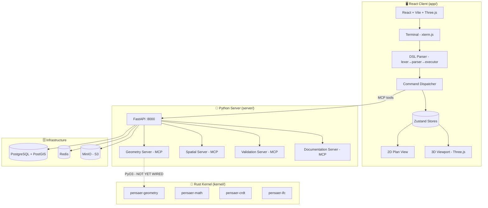
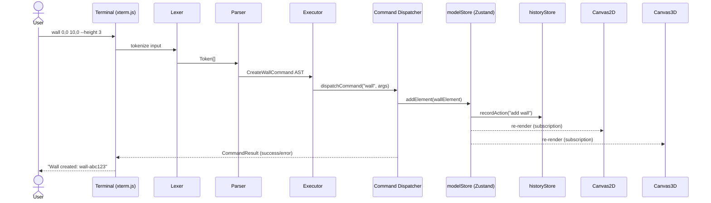
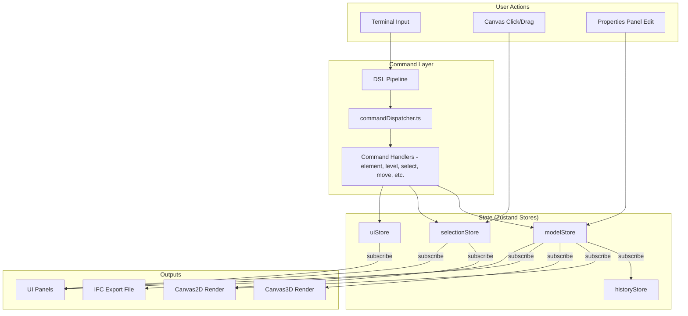
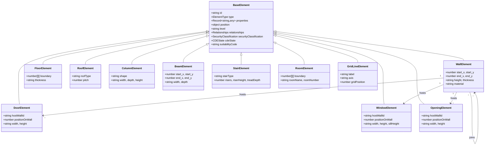
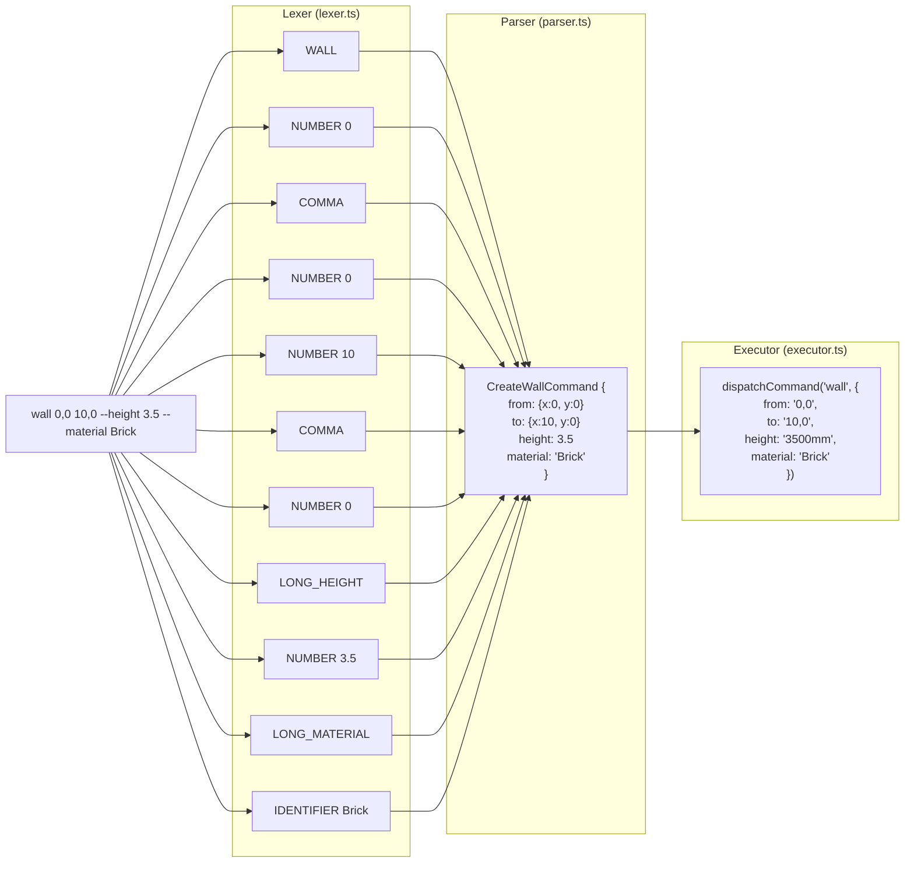
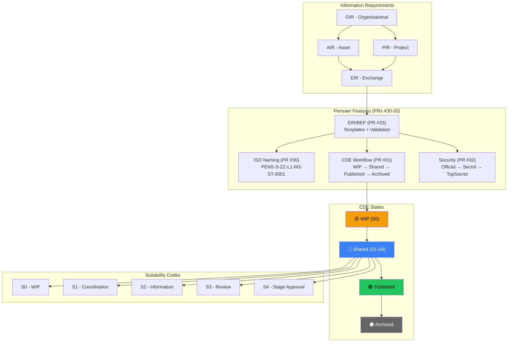
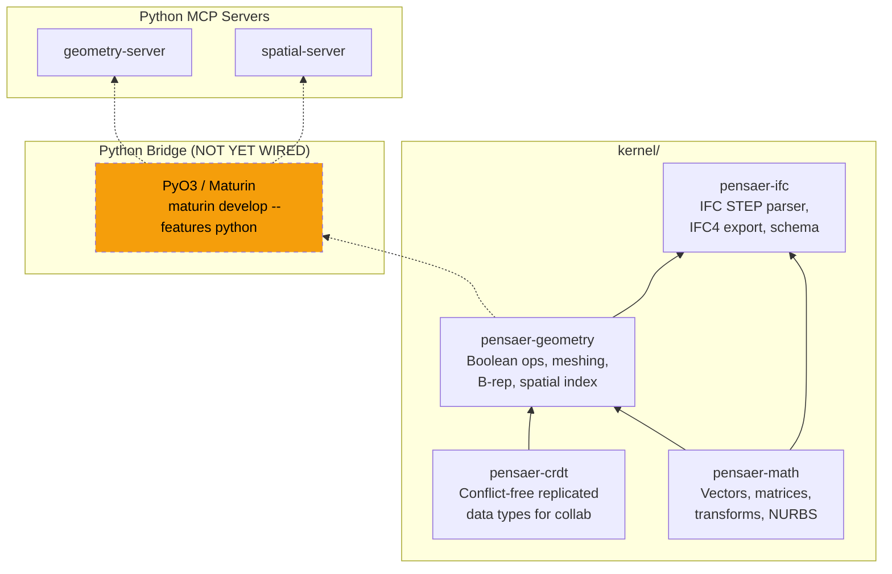
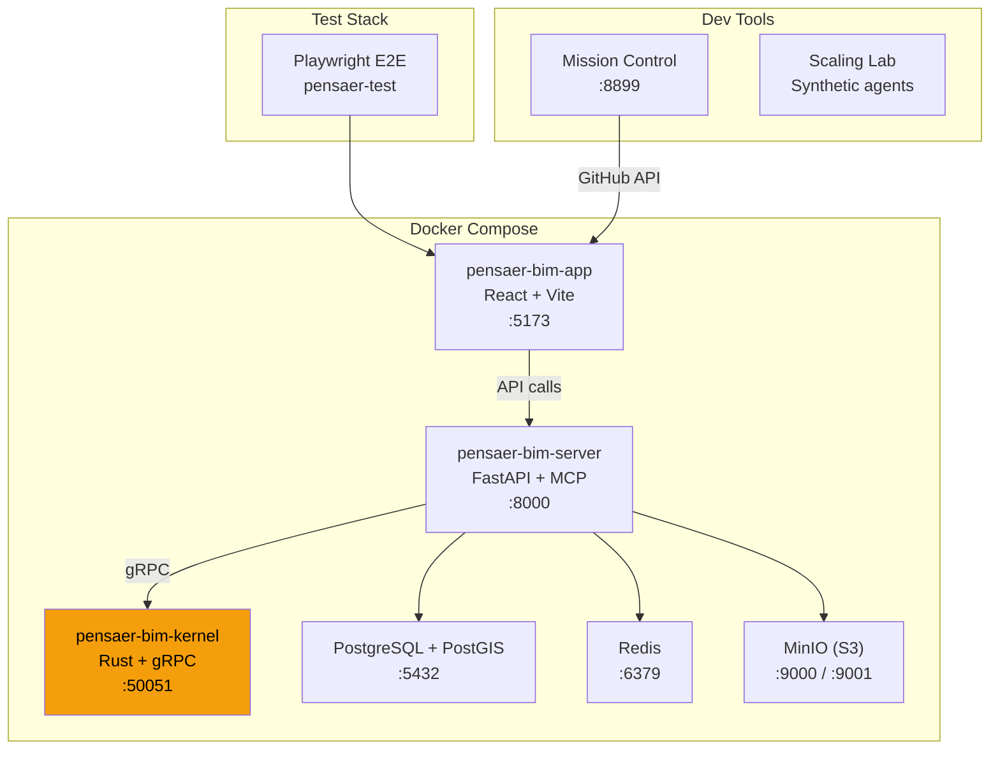
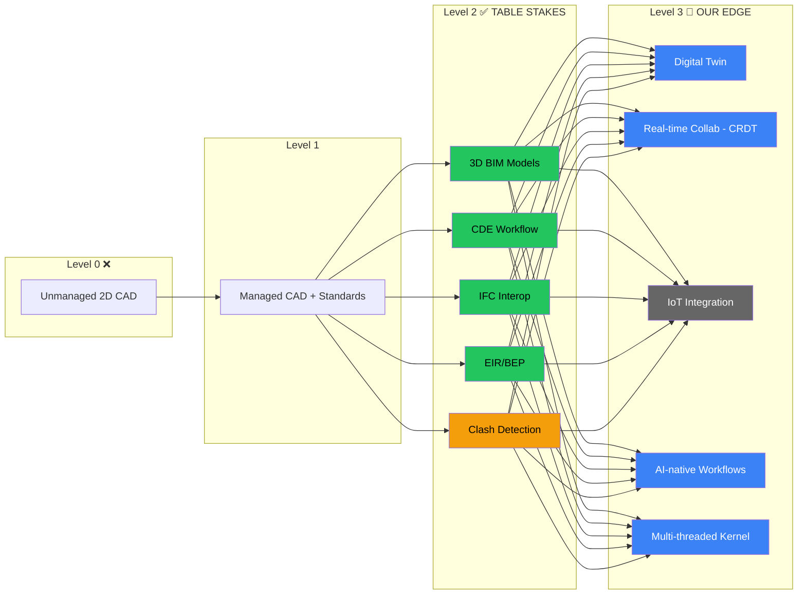

# Pensaer-BIM Architecture — AI Context Diagrams

> These Mermaid diagrams exist to give AI agents (and humans) instant system understanding.
> Preload this file in any AI session working on the codebase.

---

## 1. System Overview — The Three Pillars



---

## 2. Command Flow — User Input to Model Update



---

## 3. Client Architecture — React App Structure

```mermaid
graph LR
    subgraph "Entry"
        App[App.tsx]
    end

    subgraph "Layout Components"
        Header[Header.tsx]
        Toolbar[Toolbar.tsx]
        StatusBar[StatusBar.tsx]
        CmdPalette[CommandPalette.tsx]
    end

    subgraph "Canvas"
        C2D[Canvas2D.tsx]
        C3D[Canvas3D.tsx]
        Grid[Grid.tsx]
        Snap[SnapIndicator.tsx]
        ViewCube[ViewCube.tsx]
        Elements[elements/ - Wall, Door, Window, Room...]
    end

    subgraph "Panels"
        LayerPanel[LayerPanel.tsx]
        LevelPanel[LevelPanel.tsx]
        PropsPanel[PropertiesPanel.tsx]
        HistPanel[HistoryPanel.tsx]
        TermComp[Terminal.tsx]
    end

    subgraph "Stores (Zustand)"
        MS[modelStore - elements, levels, materials]
        SS[selectionStore - selectedIds]
        US[uiStore - activeLevel, theme, panels]
        HS[historyStore - undo/redo stack]
        TS[tokenStore - MCP usage]
        MCS[macroStore - saved commands]
    end

    subgraph "Services"
        MCP[mcpClient.ts - server connection]
        IFCExp[ifc/IfcExporter.ts]
        IFCImp[ifcParser.ts]
        Persist[persistence/ - localStorage]
        ModelIO[modelIO.ts - save/load]
    end

    subgraph "DSL Pipeline"
        Lexer[lexer.ts → Token[]]
        Parser[parser.ts → AST]
        Executor[executor.ts → dispatch]
        Errors[errors.ts - suggestions]
    end

    App --> Header & Toolbar & C2D & C3D & TermComp & StatusBar
    TermComp --> Lexer --> Parser --> Executor
    Executor --> MS & SS
    C2D --> Elements
    Elements --> MS
    PropsPanel --> SS & MS
```

---

## 4. Store Relationships — Data Flow



---

## 5. Element Type Hierarchy



---

## 6. DSL Pipeline — Lexer → Parser → Executor



---

## 7. ISO 19650 Compliance Layer



---

## 8. Rust Kernel — Crate Dependency Map



---

## 9. Infrastructure — Docker Compose Stack



---

## 10. Git Branch & PR Strategy

```mermaid
gitgraph
    commit id: "main (production)"
    branch ralphy
    commit id: "working branch"
    branch max/feature-x
    commit id: "Max builds feature"
    commit id: "Tests pass ✅"
    checkout ralphy
    merge max/feature-x id: "Rich reviews & merges"
    branch max/feature-y
    commit id: "Another feature"
    checkout ralphy
    merge max/feature-y id: "Reviewed & merged"
    checkout main
    merge ralphy id: "Release to main"
```

---

## 11. File Map — Where Things Live

```
Pensaer-BIM/
├── app/                          # React client (51K LOC)
│   └── src/
│       ├── components/
│       │   ├── canvas/           # 2D + 3D views, elements, grid, snap
│       │   ├── layout/           # Header, Toolbar, Panels, Terminal
│       │   ├── ui/               # Reusable UI components
│       │   └── debug/            # FPS, performance dashboard
│       ├── stores/               # Zustand state management
│       │   ├── modelStore.ts     # THE source of truth (elements, levels)
│       │   ├── selectionStore.ts # What's selected
│       │   ├── historyStore.ts   # Undo/redo stack
│       │   ├── uiStore.ts        # Active level, theme, panel state
│       │   ├── macroStore.ts     # Saved command macros
│       │   └── tokenStore.ts     # MCP token usage tracking
│       ├── lib/dsl/              # DSL parser pipeline
│       │   ├── lexer.ts          # Input → Token[]
│       │   ├── parser.ts         # Token[] → AST
│       │   ├── executor.ts       # AST → Command dispatch
│       │   └── tokens.ts         # Token type definitions
│       ├── commands/             # Command handlers
│       │   └── handlers/         # element, level, select, move, etc.
│       ├── services/             # MCP client, IFC, persistence
│       └── types/                # TypeScript interfaces
├── server/                       # Python backend (19K LOC)
│       ├── mcp-servers/
│       │   ├── geometry-server/  # 3D geometry operations
│       │   ├── spatial-server/   # Spatial queries, collision
│       │   ├── validation-server/# Model validation, clash detect
│       │   └── documentation-server/ # Docs, specs
│       └── mcp-bridge/           # Server bridge layer
├── kernel/                       # Rust geometry kernel (18K LOC)
│   ├── pensaer-geometry/         # Boolean ops, meshing, B-rep
│   ├── pensaer-math/             # Vectors, matrices, NURBS
│   ├── pensaer-crdt/             # Collaborative data types
│   └── pensaer-ifc/              # IFC import/export
├── pensaer_scaling_lab/          # Scaling experiments
├── deploy/                       # Docker configs
├── docs/                         # Documentation
└── scripts/                      # Build/deploy scripts
```

---

## 12. BIM Maturity Roadmap



---

## How to use this file

**For AI agents:** Preload this file at the start of any coding session on Pensaer-BIM. It provides:
- System topology (what talks to what)
- Data flow (how user input becomes model changes)
- Type hierarchy (what elements exist)
- File locations (where to find things)
- Constraints (what's wired, what's not)

**For humans:** Use the diagrams to onboard new contributors or pitch the architecture.

**Render:** GitHub renders Mermaid natively. VS Code + Mermaid extension. Or paste into [mermaid.live](https://mermaid.live).
