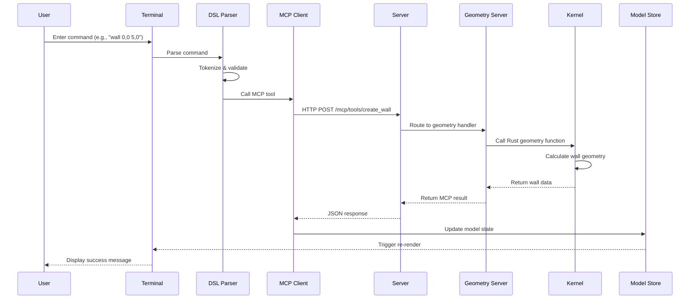
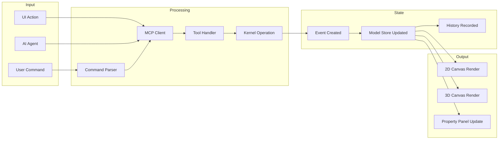
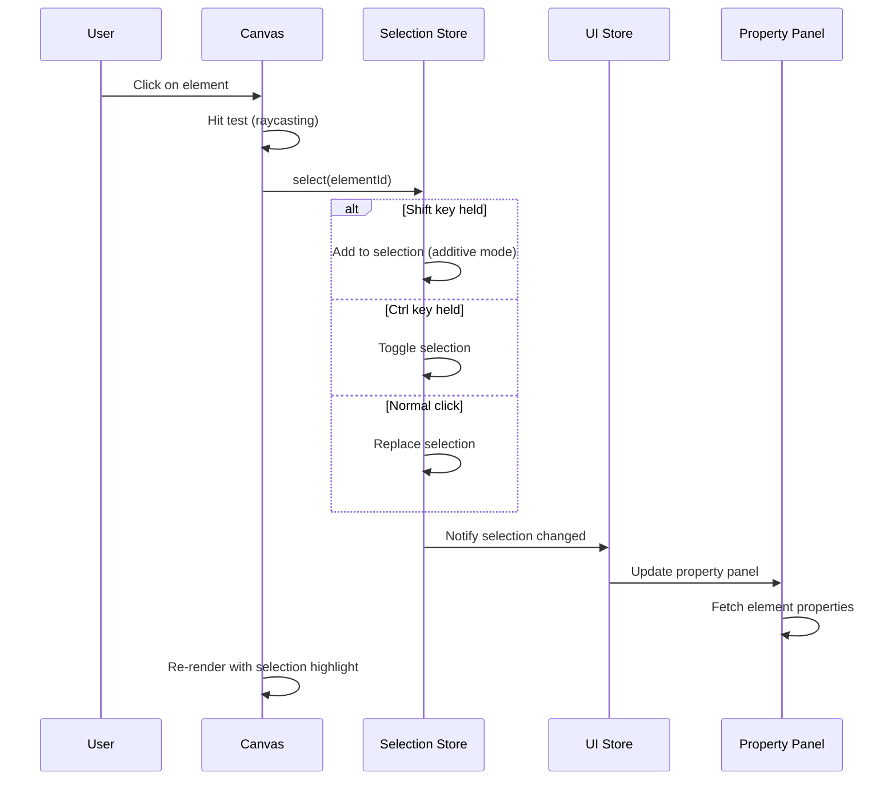
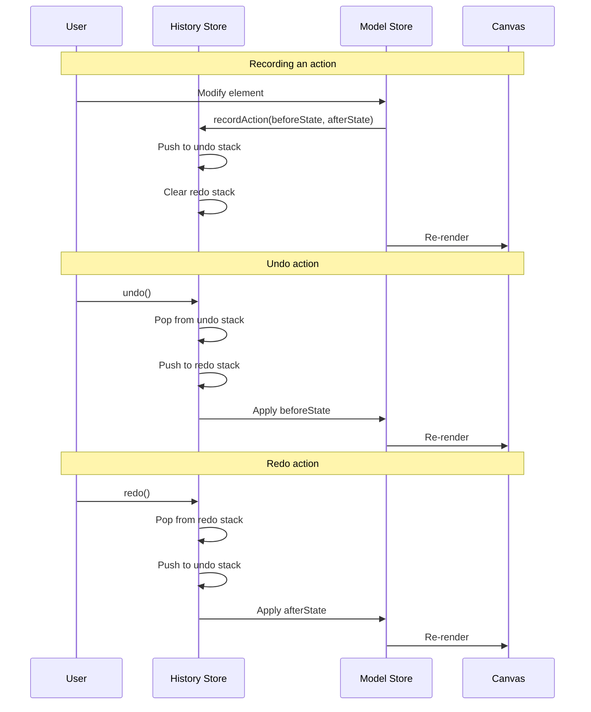
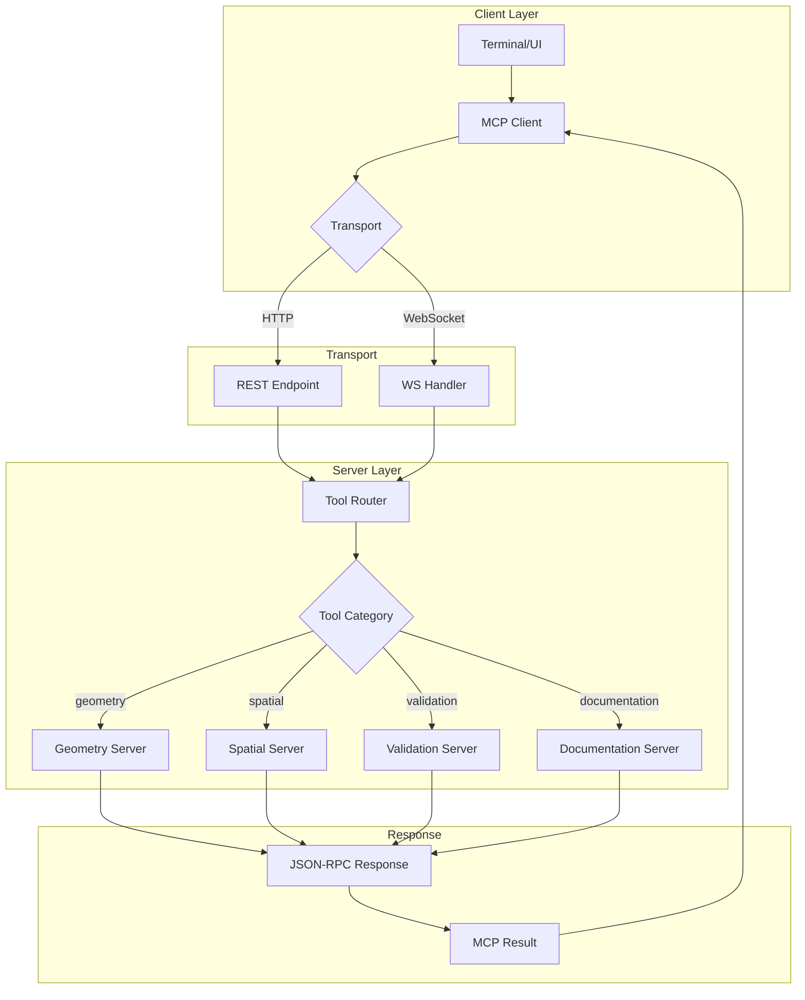
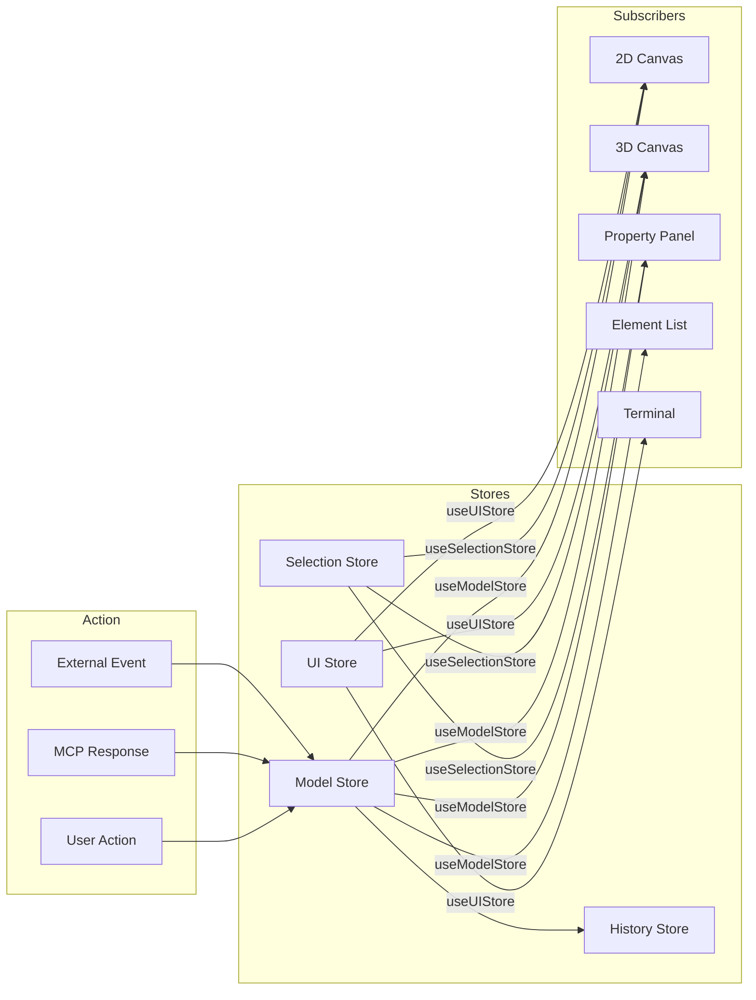
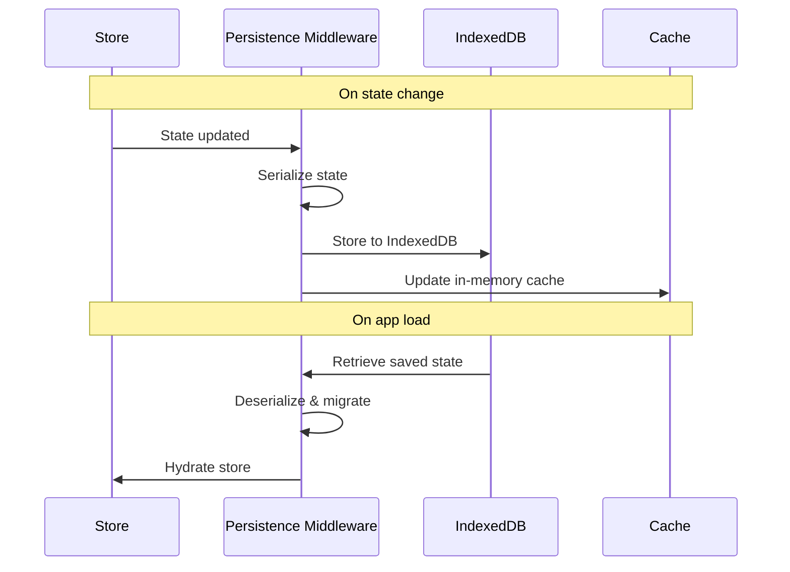
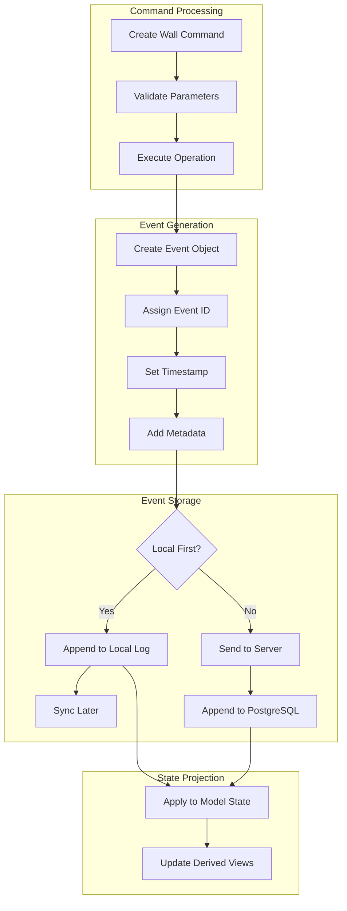
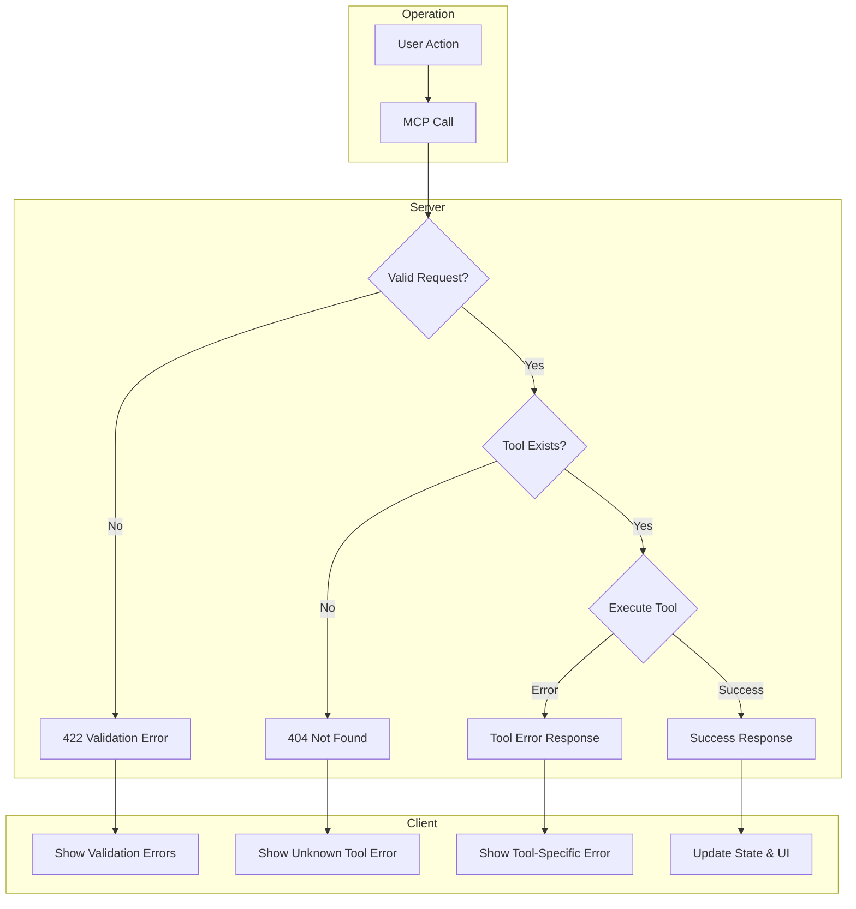
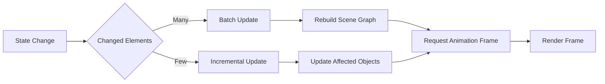

# Pensaer-BIM Data Flow Documentation

**Version:** 1.0
**Date:** January 20, 2026

---

## Overview

This document describes the data flow patterns in Pensaer-BIM, including how user actions translate to model changes and how data flows between system components.

---

## Core Data Flow Patterns

### 1. Terminal Command Flow

User commands entered in the terminal follow this flow:

### 2. Element Creation Flow

When a new BIM element is created:

### 3. Selection Flow

When elements are selected:

### 4. Undo/Redo Flow

History management and undo/redo:

---

## MCP Tool Call Flow

### Request/Response Cycle

### Tool Categories

| Category | Tools | Data Flow |
|----------|-------|-----------|
| **Geometry** | create_wall, create_door, create_floor, etc. | Input → Kernel → Model Store |
| **Spatial** | compute_adjacency, find_nearest, compute_area | Model Store → Kernel → Result |
| **Validation** | validate_model, check_accessibility, detect_clashes | Model Store → Validation Logic → Issues |
| **Documentation** | generate_schedule, export_ifc, export_report | Model Store → Formatter → Output |

---

## State Synchronization

### Local State Updates

### Persistence Flow

---

## Event Sourcing Flow

### Event Creation

### Event Types

| Event | Trigger | Affected State |
|-------|---------|----------------|
| `element.created` | Create command | Model Store elements |
| `element.modified` | Update command | Model Store elements |
| `element.deleted` | Delete command | Model Store elements |
| `elements.joined` | Join walls | Relationships |
| `selection.changed` | Click/select | Selection Store |
| `view.changed` | Pan/zoom/rotate | UI Store |

---

## Error Handling Flow

---

## Performance Considerations

### Rendering Pipeline

### Optimization Strategies

1. **Selective Re-rendering**: Only update canvas when relevant state changes
2. **Level of Detail (LOD)**: Reduce geometry complexity at distance
3. **Frustum Culling**: Don't render off-screen elements
4. **Batched State Updates**: Group rapid changes into single render cycle
5. **Virtualized Lists**: Only render visible elements in lists

---

## Related Documents

- [Architecture Overview](./overview.md)
- [State Management](./state-management.md)
- [Event Sourcing](./event-sourcing.md)
- [MCP Tool Surface](../mcp/TOOL_SURFACE.md)
