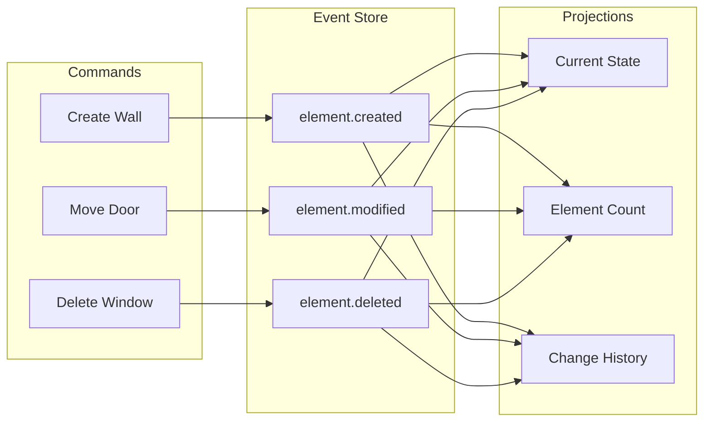
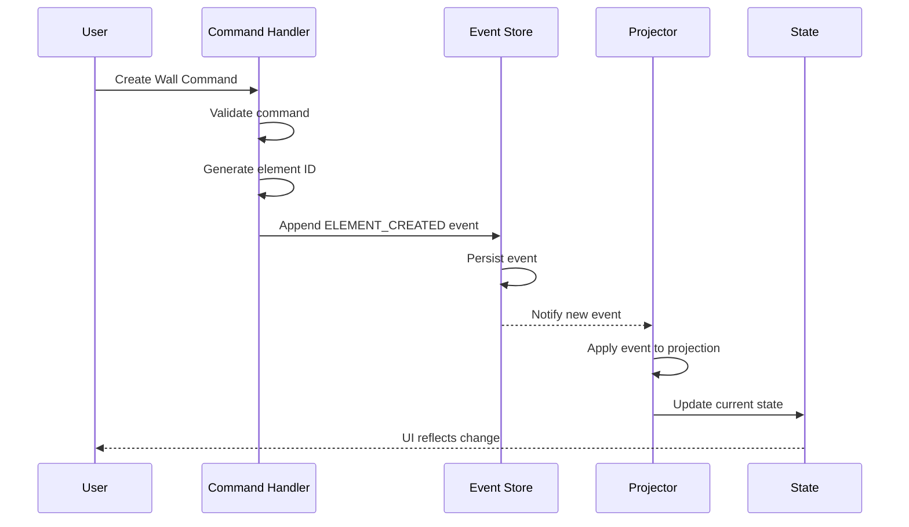
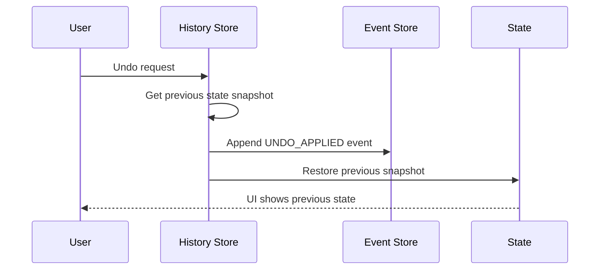
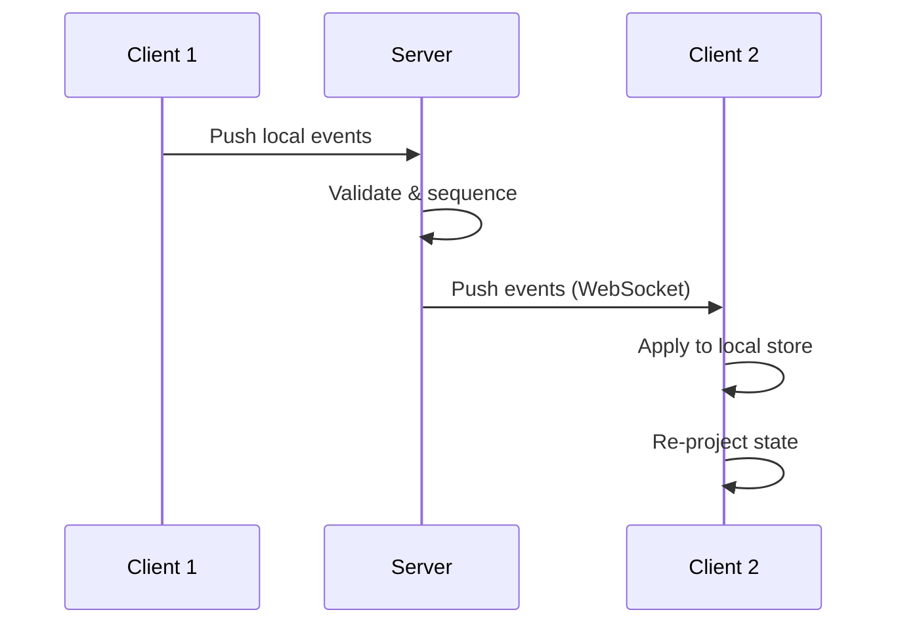
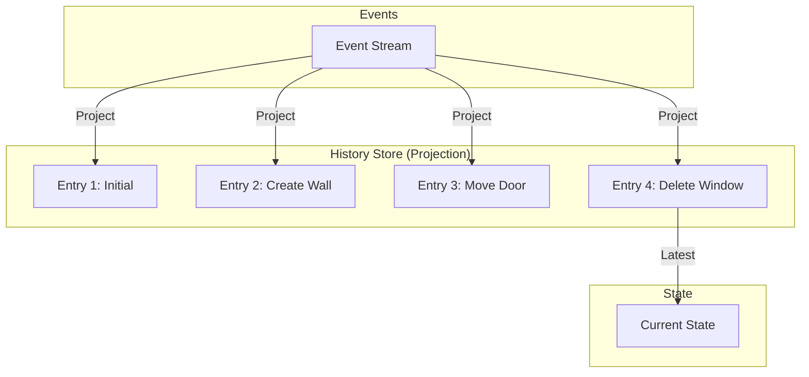

# Pensaer-BIM Event Sourcing Pattern Documentation

**Version:** 1.0
**Date:** January 20, 2026

---

## Overview

Pensaer-BIM uses **Event Sourcing** as the foundation for model state management. Instead of storing the current state directly, we store a sequence of events that led to that state.

### Benefits

- **Complete Audit Trail**: Every change is recorded with who, when, and why
- **Time Travel**: Navigate to any point in model history
- **Undo/Redo**: Natural support for reversible operations
- **Debugging**: Replay events to reproduce issues
- **Collaboration**: Merge changes from multiple users via event streams

---

## Event Sourcing Architecture



---

## Core Concepts

### 1. Events

Events are immutable records of something that happened:

```typescript
interface BIMEvent {
  id: string;              // Unique event ID
  eventType: EventType;    // Type of event
  aggregateId: string;     // Element/entity this affects
  timestamp: number;       // When it happened
  userId: string;          // Who did it
  branchId: string;        // Which branch
  payload: object;         // Event-specific data

  // Optional metadata
  agentId?: string;        // If done by AI agent
  reasoning?: string;      // Why (for AI operations)
}
```

### 2. Event Types

```typescript
enum EventType {
  // Element Lifecycle
  ELEMENT_CREATED = 'element.created',
  ELEMENT_MODIFIED = 'element.modified',
  ELEMENT_DELETED = 'element.deleted',

  // Relationships
  ELEMENTS_JOINED = 'elements.joined',
  ELEMENT_HOSTED = 'element.hosted',
  CONSTRAINT_ADDED = 'constraint.added',

  // Views
  VIEW_CREATED = 'view.created',
  SCHEDULE_GENERATED = 'schedule.generated',

  // Collaboration
  BRANCH_CREATED = 'branch.created',
  BRANCH_MERGED = 'branch.merged',
  CONFLICT_RESOLVED = 'conflict.resolved',
}
```

### 3. Projections

Projections are derived views from the event stream:

| Projection | Purpose | Update Trigger |
|------------|---------|----------------|
| **Current State** | Model elements | Every change event |
| **Element Count** | Statistics | Create/delete events |
| **History Timeline** | Undo/redo | All events |
| **Audit Log** | Compliance | All events with metadata |

---

## Event Flow

### Creating an Element



### Undo Operation



---

## Implementation Details

### Client-Side Event Store

In Phase 1, events are stored client-side with IndexedDB:

```typescript
interface LocalEventStore {
  events: BIMEvent[];           // Append-only log
  snapshots: Snapshot[];        // Periodic state snapshots
  currentHead: number;          // Latest applied event index
}

interface Snapshot {
  id: string;
  eventIndex: number;           // Event index this snapshot is at
  timestamp: number;
  elements: Element[];          // Full state at this point
}
```

### Snapshot Strategy

To avoid replaying all events on load:

1. **Full Snapshot**: Every 100 events or 1 hour
2. **Incremental**: After significant changes (bulk operations)
3. **On Demand**: Before closing the application

```typescript
function shouldCreateSnapshot(eventStore: LocalEventStore): boolean {
  const eventsSinceSnapshot = eventStore.events.length -
    (eventStore.snapshots.at(-1)?.eventIndex ?? 0);

  return eventsSinceSnapshot >= 100;
}
```

### Event Replay

Rebuilding state from events:

```typescript
function replayEvents(
  events: BIMEvent[],
  fromSnapshot?: Snapshot
): Element[] {
  // Start from snapshot if available
  let state: Element[] = fromSnapshot?.elements ?? [];
  const startIndex = fromSnapshot?.eventIndex ?? 0;

  // Apply each event
  for (let i = startIndex; i < events.length; i++) {
    state = applyEvent(state, events[i]);
  }

  return state;
}

function applyEvent(state: Element[], event: BIMEvent): Element[] {
  switch (event.eventType) {
    case EventType.ELEMENT_CREATED:
      return [...state, event.payload.element];

    case EventType.ELEMENT_MODIFIED:
      return state.map(el =>
        el.id === event.aggregateId
          ? { ...el, ...event.payload.updates }
          : el
      );

    case EventType.ELEMENT_DELETED:
      return state.filter(el => el.id !== event.aggregateId);

    default:
      return state;
  }
}
```

---

## Event Payloads

### ELEMENT_CREATED

```typescript
interface ElementCreatedPayload {
  element: Element;
  source: 'terminal' | 'ui' | 'agent' | 'import';
}

// Example
{
  eventType: 'element.created',
  aggregateId: 'wall-123',
  payload: {
    element: {
      id: 'wall-123',
      type: 'wall',
      name: 'Wall A',
      x: 0,
      y: 0,
      width: 500,
      height: 20,
      // ...
    },
    source: 'terminal'
  }
}
```

### ELEMENT_MODIFIED

```typescript
interface ElementModifiedPayload {
  updates: Partial<Element>;
  previousValues: Partial<Element>;  // For undo
}

// Example
{
  eventType: 'element.modified',
  aggregateId: 'wall-123',
  payload: {
    updates: { x: 100 },
    previousValues: { x: 0 }
  }
}
```

### ELEMENT_DELETED

```typescript
interface ElementDeletedPayload {
  element: Element;  // Full element for undo
  cascadeDeleted: string[];  // Related elements also deleted
}
```

---

## Collaboration (Future)

### Server-Side Event Store

In later phases, events sync to PostgreSQL:

```sql
CREATE TABLE events (
    id UUID PRIMARY KEY DEFAULT gen_random_uuid(),
    sequence_num BIGSERIAL,
    timestamp TIMESTAMPTZ DEFAULT now(),
    event_type VARCHAR(100) NOT NULL,
    aggregate_id UUID NOT NULL,
    payload JSONB NOT NULL,
    user_id UUID NOT NULL,
    branch_id UUID NOT NULL,
    CONSTRAINT events_sequence_unique UNIQUE (branch_id, sequence_num)
);
```

### Sync Protocol



### Conflict Resolution

For concurrent edits to same element:

1. **Last-Write-Wins**: Simple but may lose data
2. **CRDT Merge**: For collaborative text/properties
3. **User Resolution**: Show conflict UI for complex cases

---

## Integration with History Store

The History Store is a client-side projection of the event stream:



### History Entry vs Event

| Aspect | Event | History Entry |
|--------|-------|---------------|
| **Granularity** | Single operation | May batch multiple events |
| **Storage** | Permanent, append-only | Limited stack size |
| **Purpose** | Source of truth | UI navigation |
| **Content** | Diff/delta | Full snapshot |

---

## Best Practices

### 1. Event Granularity

Events should be atomic and meaningful:

```typescript
// Good - single logical operation
{ eventType: 'element.created', payload: { element: wall } }

// Bad - too granular
{ eventType: 'element.position.x.set', payload: { x: 100 } }
{ eventType: 'element.position.y.set', payload: { y: 200 } }

// Bad - too coarse
{ eventType: 'model.changed', payload: { allElements: [...] } }
```

### 2. Include Enough for Undo

Always include data needed to reverse the operation:

```typescript
// Good - includes previous value
{
  eventType: 'element.modified',
  payload: {
    updates: { x: 100 },
    previousValues: { x: 0 }  // Can undo
  }
}

// Bad - can't undo
{
  eventType: 'element.modified',
  payload: { updates: { x: 100 } }  // No previous value
}
```

### 3. Event Naming

Use past tense for events (they've already happened):

```typescript
// Good
'element.created'
'element.modified'
'element.deleted'

// Bad
'element.create'
'element.modify'
'element.delete'
```

### 4. Idempotency

Events should be safely replayable:

```typescript
// Good - uses explicit ID
{ eventType: 'element.created', aggregateId: 'wall-123', ... }

// Bad - generates new ID each replay
{ eventType: 'element.created', aggregateId: uuid(), ... }
```

---

## Debugging

### Event Replay Debugging

```typescript
// Replay events one by one for debugging
function debugReplay(events: BIMEvent[]) {
  let state: Element[] = [];

  events.forEach((event, index) => {
    console.log(`Event ${index}:`, event.eventType, event.aggregateId);
    state = applyEvent(state, event);
    console.log('State after:', state.length, 'elements');
  });

  return state;
}
```

### Event Inspector

The terminal provides debugging commands:

```bash
# Show event history
events list

# Show specific event
events show <event-id>

# Replay to specific point
events replay --to <index>

# Export events
events export events.json
```

---

## Related Documents

- [Architecture Overview](./overview.md)
- [Data Flow](./data-flow.md)
- [State Management](./state-management.md)
- [Canonical Architecture](./CANONICAL_ARCHITECTURE.md) - Event Store schema
