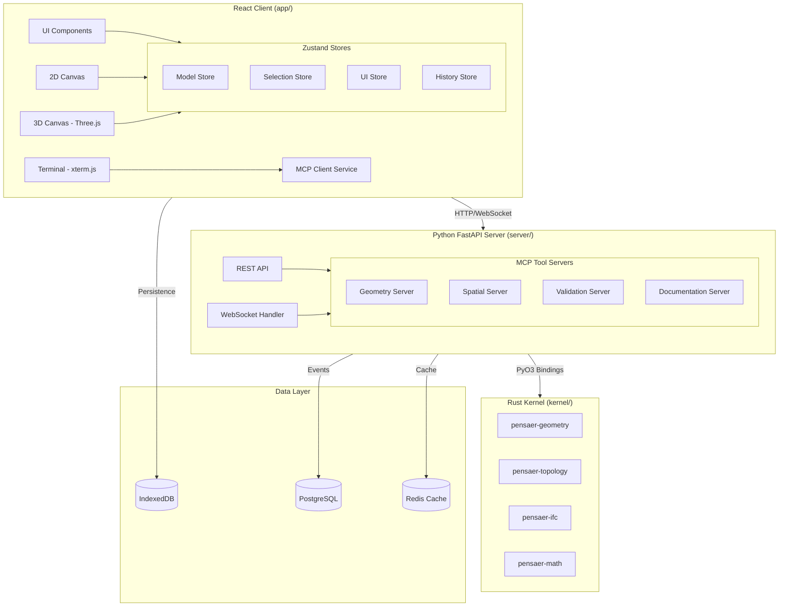

# Pensaer-BIM Architecture Overview

**Version:** 1.0
**Date:** January 20, 2026
**Status:** Living Document

---

## Introduction

Pensaer-BIM is a developer-first Building Information Modeling (BIM) platform with keyboard-driven workflows, real-time collaboration, and AI agent integration via MCP (Model Context Protocol).

This document provides a comprehensive overview of the system architecture, complementing the [Canonical Architecture](./CANONICAL_ARCHITECTURE.md) with implementation details and diagrams.

---

## System Architecture Diagram



---

## Component Overview

### Layer 1: React Client (`app/`)

The web client provides the user interface for interacting with BIM models.

| Component | Technology | Purpose |
|-----------|------------|---------|
| **UI Framework** | React 19 + TypeScript | Type-safe functional components |
| **State Management** | Zustand + Immer | Immutable state with minimal boilerplate |
| **3D Rendering** | Three.js + @react-three/fiber | WebGL-based 3D visualization |
| **2D Rendering** | Canvas 2D API | Floor plan views |
| **Terminal** | xterm.js | Integrated command-line interface |
| **Styling** | Tailwind CSS | Utility-first CSS framework |
| **Build Tool** | Vite | Fast HMR and ESM-native builds |

### Layer 2: Python Server (`server/`)

The server hosts MCP tool servers and provides the API layer.

| Component | Technology | Purpose |
|-----------|------------|---------|
| **API Framework** | FastAPI | Async HTTP and WebSocket endpoints |
| **Validation** | Pydantic v2 | Request/response type validation |
| **MCP Protocol** | JSON-RPC 2.0 | Tool invocation protocol |
| **DSL Parser** | Custom lexer/parser | Domain-specific language for BIM |

### Layer 3: Rust Kernel (`kernel/`)

The performance-critical core implemented in Rust with Python bindings.

| Crate | Purpose |
|-------|---------|
| **pensaer-geometry** | Geometric primitives and operations |
| **pensaer-topology** | Spatial relationships and graph operations |
| **pensaer-ifc** | IFC import/export functionality |
| **pensaer-math** | Mathematical utilities |

---

## Key Architectural Decisions

### 1. Event Sourcing

All model changes are recorded as immutable events, enabling:
- Complete audit trail
- Undo/redo functionality
- Time-travel debugging
- Conflict-free collaboration

See [Event Sourcing Documentation](./event-sourcing.md) for details.

### 2. MCP Tool Protocol

AI agents interact with the system through standardized MCP tools:
- JSON-RPC 2.0 over HTTP/WebSocket
- Typed tool definitions with Pydantic schemas
- Governance layer for approval gates

See [MCP Server Design](../mcp/SERVER_DESIGN.md) for specifications.

### 3. Sacred Invariant

> "All outputs are consistent projections of a single authoritative model state."

This principle ensures that:
- Views are derived, never stored
- Changes propagate consistently
- The model is always in a valid state

---

## Directory Structure

```
Pensaer-BIM/
├── app/                    # React TypeScript client
│   ├── src/
│   │   ├── components/     # UI components
│   │   │   ├── layout/     # App layout components
│   │   │   ├── canvas/     # 2D/3D canvas components
│   │   │   └── ui/         # Reusable UI primitives
│   │   ├── stores/         # Zustand state stores
│   │   ├── services/       # API and MCP clients
│   │   ├── hooks/          # Custom React hooks
│   │   ├── types/          # TypeScript interfaces
│   │   ├── commands/       # Terminal command handlers
│   │   └── utils/          # Utility functions
│   └── public/             # Static assets
│
├── server/                 # Python FastAPI server
│   ├── app/pensaer/        # Application code
│   │   ├── dsl/            # DSL parser
│   │   └── mcp/            # MCP utilities
│   ├── mcp-servers/        # MCP tool servers
│   │   ├── geometry-server/
│   │   ├── spatial-server/
│   │   ├── validation-server/
│   │   └── documentation-server/
│   └── tests/              # Python tests
│
├── kernel/                 # Rust kernel crates
│   ├── pensaer-geometry/
│   ├── pensaer-topology/
│   ├── pensaer-ifc/
│   └── pensaer-math/
│
└── docs/                   # Documentation
    ├── architecture/       # Architecture docs
    ├── mcp/                # MCP specifications
    └── adr/                # Architecture Decision Records
```

---

## Related Documents

- [Canonical Architecture](./CANONICAL_ARCHITECTURE.md) - Authoritative architecture reference
- [Tech Stack](./TECH_STACK.md) - Technology decisions
- [Data Flow](./data-flow.md) - Data flow diagrams
- [State Management](./state-management.md) - Zustand store architecture
- [Event Sourcing](./event-sourcing.md) - Event sourcing patterns
- [Glossary](./GLOSSARY.md) - Terminology definitions
