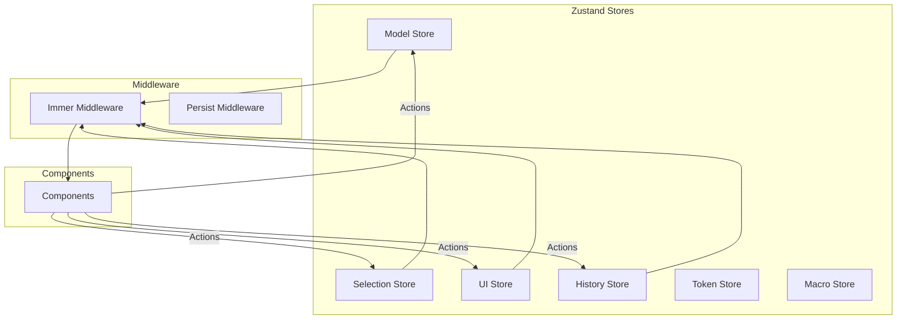
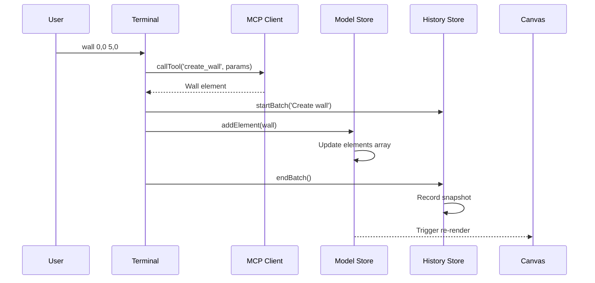
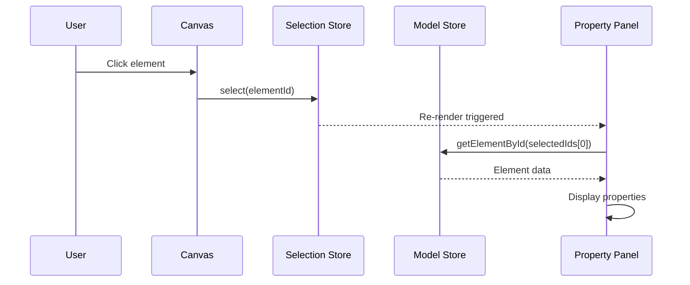

# Pensaer-BIM State Management Documentation

**Version:** 1.0
**Date:** January 20, 2026

---

## Overview

Pensaer-BIM uses **Zustand** with **Immer** for state management. This provides:

- Minimal boilerplate compared to Redux
- Immutable updates via Immer's produce function
- TypeScript support out of the box
- React-friendly with automatic re-renders
- Simple testing and debugging

---

## Store Architecture



---

## Store Summary

| Store | Purpose | Key State | Persistence |
|-------|---------|-----------|-------------|
| **Model Store** | BIM elements and levels | `elements[]`, `levels[]` | IndexedDB |
| **Selection Store** | Selection and highlights | `selectedIds[]`, `hoveredId` | None |
| **UI Store** | UI state and tools | `activeTool`, `viewMode`, `zoom` | None |
| **History Store** | Undo/redo | `entries[]`, `currentIndex` | None |
| **Token Store** | API token tracking | `usage`, `limits` | None |
| **Macro Store** | Terminal macros | `macros[]` | LocalStorage |

---

## Model Store

The central store for all BIM elements and building levels.

### State Interface

```typescript
interface ModelState {
  elements: Element[];      // All BIM elements
  levels: Level[];         // Building levels
  isLoading: boolean;      // Loading indicator
  error: string | null;    // Error message
}
```

### Actions

| Action | Description | Usage |
|--------|-------------|-------|
| `addElement(element)` | Add a new element | `wall 0,0 5,0` command |
| `updateElement(id, updates)` | Update element properties | Property panel edits |
| `deleteElement(id)` | Remove an element | Delete command |
| `deleteElements(ids)` | Bulk delete | Multi-select delete |
| `setElements(elements)` | Replace all elements | File import, undo |
| `clearElements()` | Remove all elements | New project |

### Query Helpers

```typescript
// Get element by ID
const element = useModelStore.getState().getElementById(id);

// Get elements by type
const walls = useModelStore.getState().getElementsByType('wall');

// Get related elements (hosts, joins, bounds)
const related = useModelStore.getState().getRelatedElements(id);

// Get elements on a level
const level1Elements = useModelStore.getState().getElementsByLevel('level-1');
```

### Usage in Components

```typescript
function WallList() {
  // Subscribe to wall elements only
  const walls = useModelStore((state) =>
    state.elements.filter(el => el.type === 'wall')
  );

  // Get actions
  const { deleteElement } = useModelStore();

  return (
    <ul>
      {walls.map(wall => (
        <li key={wall.id}>
          {wall.name}
          <button onClick={() => deleteElement(wall.id)}>Delete</button>
        </li>
      ))}
    </ul>
  );
}
```

---

## Selection Store

Manages element selection, hover, and highlight states.

### State Interface

```typescript
interface SelectionState {
  selectedIds: string[];    // Currently selected element IDs
  hoveredId: string | null; // Element under cursor
  highlightedIds: string[]; // AI suggestions, issues, etc.
}
```

### Selection Modes

| Mode | Trigger | Behavior |
|------|---------|----------|
| **Single** | Click | Replace selection |
| **Additive** | Shift+Click | Add to selection |
| **Toggle** | Ctrl+Click | Toggle in/out of selection |

### Actions

```typescript
// Single selection
select(id);

// Multiple selection
selectMultiple([id1, id2, id3]);

// Add to existing selection
addToSelection(id);

// Toggle selection state
toggleSelection(id);

// Clear all selection
clearSelection();

// Select all elements
selectAll(allIds);
```

### Usage Example

```typescript
function Canvas2D() {
  const { selectedIds, hoveredId, select, setHovered } = useSelectionStore();

  const handleClick = (elementId: string, event: MouseEvent) => {
    if (event.shiftKey) {
      useSelectionStore.getState().addToSelection(elementId);
    } else if (event.ctrlKey) {
      useSelectionStore.getState().toggleSelection(elementId);
    } else {
      select(elementId);
    }
  };

  const handleHover = (elementId: string | null) => {
    setHovered(elementId);
  };

  // Render with selection/hover states...
}
```

---

## UI Store

Manages application UI state including tools, views, and panels.

### State Interface

```typescript
interface UIState {
  // Tool State
  activeTool: ToolType;        // 'select' | 'wall' | 'door' | etc.
  isDrawing: boolean;          // Currently drawing
  drawStart: Point | null;     // Draw start position
  drawEnd: Point | null;       // Draw end position

  // View State
  viewMode: '2d' | '3d';       // Current view mode
  zoom: number;                // Zoom level (0.1 - 5)
  panX: number;                // Pan offset X
  panY: number;                // Pan offset Y
  activeLevel: string;         // Active building level

  // Layer Visibility
  hiddenLayers: Set<string>;   // Hidden element types
  lockedLayers: Set<string>;   // Locked element types

  // Panels
  showCommandPalette: boolean;
  showPropertiesPanel: boolean;
  showLayersPanel: boolean;
  showSnapSettings: boolean;

  // Snap Settings
  snap: SnapSettings;

  // Toasts
  toasts: Toast[];
}
```

### Tool Types

```typescript
type ToolType =
  | 'select'
  | 'wall'
  | 'door'
  | 'window'
  | 'room'
  | 'floor'
  | 'roof'
  | 'measure'
  | 'annotate';
```

### View Actions

```typescript
// Switch view mode
setViewMode('3d');

// Zoom controls
zoomIn();      // 1.2x zoom
zoomOut();     // 0.8x zoom
setZoom(1.5);  // Set specific zoom
zoomToFit();   // Reset view

// Pan
pan(deltaX, deltaY);

// Level
setActiveLevel('Level 2');
```

### Toast Notifications

```typescript
// Add toast (auto-dismisses except errors)
addToast('success', 'Wall created');
addToast('error', 'Failed to connect');
addToast('warning', 'Unsaved changes');
addToast('info', 'Tip: Use Tab to autocomplete');

// Manual removal
removeToast(toastId);
```

---

## History Store

Implements undo/redo with snapshot-based history.

### State Interface

```typescript
interface HistoryState {
  entries: HistoryEntry[];  // History stack
  currentIndex: number;     // Current position
  isUndoing: boolean;       // Prevents recursive recording
  batchStack: BatchContext[];
  isBatching: boolean;
}

interface HistoryEntry {
  id: string;
  timestamp: number;
  description: string;      // Human-readable action name
  elements: Element[];      // Full element snapshot
}
```

### Core Operations

```typescript
// Record after mutation
recordAction('Create wall');

// Undo/Redo
undo();
redo();

// Jump to specific point
jumpToEntry(index);

// Check availability
const canUndo = useHistoryStore.getState().canUndo();
const canRedo = useHistoryStore.getState().canRedo();
```

### Batch Operations

Group multiple actions into a single undo step:

```typescript
const batchId = startBatch('Align walls');

try {
  // Multiple operations...
  updateElement(id1, { x: 0 });
  updateElement(id2, { x: 0 });
  updateElement(id3, { x: 0 });

  endBatch(batchId);  // Records as single undo step
} catch (error) {
  cancelBatch(batchId);  // Reverts all changes
}
```

### Keyboard Shortcuts

| Shortcut | Action |
|----------|--------|
| `Ctrl+Z` | Undo |
| `Ctrl+Shift+Z` | Redo |
| `Ctrl+Y` | Redo (Windows) |

---

## Store Interactions

### Creating an Element



### Selection with Properties



---

## Best Practices

### 1. Selective Subscriptions

Only subscribe to the state you need:

```typescript
// Good - only re-renders when selectedIds changes
const selectedIds = useSelectionStore((s) => s.selectedIds);

// Bad - re-renders on any state change
const store = useSelectionStore();
```

### 2. Computed Values

Use selectors for derived state:

```typescript
// Good - memoized selector
const wallCount = useModelStore((s) =>
  s.elements.filter(el => el.type === 'wall').length
);

// Avoid computing in render
const walls = useModelStore((s) => s.elements).filter(...); // Don't do this
```

### 3. Actions Outside React

Access store state/actions outside components:

```typescript
// Get state
const elements = useModelStore.getState().elements;

// Call actions
useModelStore.getState().addElement(newElement);
useHistoryStore.getState().recordAction('Create element');
```

### 4. Batching Updates

Group related changes:

```typescript
// Batch multiple updates
const batchId = useHistoryStore.getState().startBatch('Move elements');
selectedIds.forEach(id => {
  useModelStore.getState().updateElement(id, { x: newX });
});
useHistoryStore.getState().endBatch(batchId);
```

---

## Testing Stores

### Unit Testing

```typescript
import { useModelStore } from '../stores/modelStore';

describe('ModelStore', () => {
  beforeEach(() => {
    // Reset store between tests
    useModelStore.setState({ elements: [], levels: [] });
  });

  it('should add element', () => {
    const element = { id: 'test-1', type: 'wall', ... };

    useModelStore.getState().addElement(element);

    expect(useModelStore.getState().elements).toHaveLength(1);
    expect(useModelStore.getState().getElementById('test-1')).toBeDefined();
  });
});
```

### Integration Testing

```typescript
import { renderHook, act } from '@testing-library/react';

it('should undo element creation', () => {
  const { result: modelResult } = renderHook(() => useModelStore());
  const { result: historyResult } = renderHook(() => useHistoryStore());

  act(() => {
    modelResult.current.addElement(testElement);
    historyResult.current.recordAction('Create wall');
  });

  expect(modelResult.current.elements).toHaveLength(1);

  act(() => {
    historyResult.current.undo();
  });

  expect(modelResult.current.elements).toHaveLength(0);
});
```

---

## Related Documents

- [Architecture Overview](./overview.md)
- [Data Flow](./data-flow.md)
- [Event Sourcing](./event-sourcing.md)
- [TypeScript Types](../../app/src/types/index.ts)
